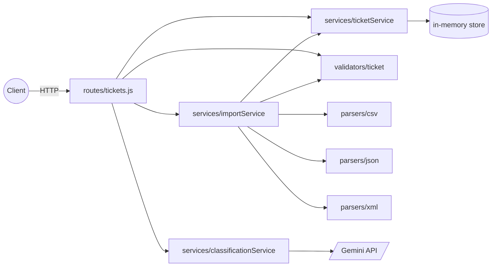

# Homework 2 — Intelligent Customer Support System

> **Student:** Shtefunik
> **Date Submitted:** 2026-05-03
> **AI Tools Used:** Claude Code (Opus 4.7) for design + implementation; Google Gemini 2.0 Flash via `@google/genai` for runtime ticket classification.

REST API for support tickets with multi-format import (CSV / JSON / XML) and Gemini-powered auto-classification.

## Features

- 7 REST endpoints covering full ticket lifecycle
- CSV / JSON / XML bulk import with per-row failure reporting
- Auto-classification (category + priority + confidence + reasoning + keywords) via Gemini 2.0 Flash with strict JSON response schema
- Manual override via PUT
- Validation via Zod (RFC5322 emails, length bounds, enum membership)
- 91 tests with ≥85% coverage; one opt-in test against the real Gemini API

## Architecture (component diagram)



## Tech Stack

- Node.js ≥ 20 (ESM)
- Express 5.2 (auto-async error handling)
- `@google/genai` with `gemini-2.0-flash`
- Zod for validation
- `csv-parse`, `fast-xml-parser`
- Vitest 4 + `@vitest/coverage-v8`, `supertest`

## Project Structure

See `docs/superpowers/specs/2026-05-03-customer-support-design.md` for the full module map.

## Running

See `HOWTORUN.md`.

## Tests

```bash
npm test                # default — all mocked, no API key needed (91 tests)
npm run coverage        # produces coverage/index.html (≥85% across all metrics)
npm run test:live       # opt-in real Gemini call (requires GEMINI_API_KEY)
```

## Documentation

| File | Audience |
|---|---|
| `docs/API_REFERENCE.md` | API consumers |
| `docs/ARCHITECTURE.md` | Tech leads |
| `docs/TESTING_GUIDE.md` | QA |
| `docs/AI_USAGE.md` | Reviewer / instructor |
| `HOWTORUN.md` | Anyone running locally |
