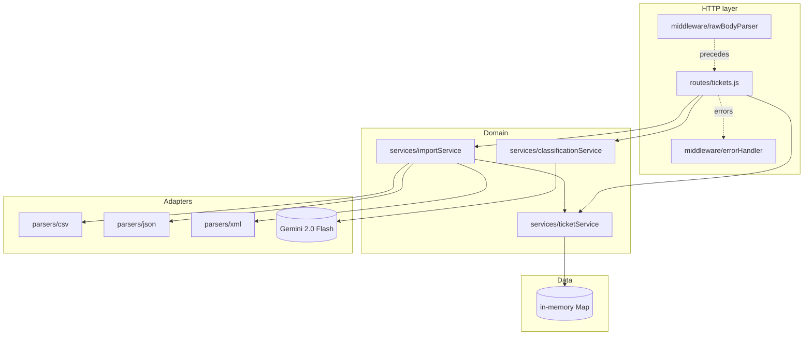
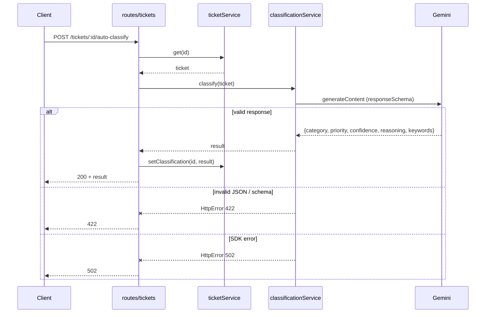

# Architecture

## High-level

## Auto-classification sequence

## Design decisions

| Decision | Why |
|---|---|
| In-memory `Map` storage | Spec doesn't require persistence; concurrent access is safe under Node's single-threaded event loop |
| Gemini-only classification (no rule fallback) | Showcases real LLM integration; rules are passed to Gemini in the system prompt instead of duplicated in JS |
| Default tests fully mock the SDK | The instructor doesn't have our `GEMINI_API_KEY`; their `npm test` must pass |
| Raw body + `?format=` query param for `/tickets/import` | Avoids `multer` dependency, makes `curl --data-binary @file.csv` natural for demos |
| Soft-fail classification during create/import | Bulk import doesn't get blocked by a single LLM failure; explicit `/auto-classify` still fails loud |
| `setClassification` on the service | Keeps ticket store writes encapsulated; no live-reference mutation from routes |
| Structured `contents` (role + delimiters) sent to Gemini | Reduces prompt-injection surface from user-supplied subject/description |

## Security & performance considerations

- API key only loaded from `.env` (`dotenv`); `.env` is gitignored.
- Body size limit: 5 MB (`express.json` and `rawBodyParser`).
- No user authentication — out of scope per TASKS.md.
- Map-backed list scans linearly; for ~1000 tickets the GET filter test asserts <100ms.
- Express 5 catches async errors automatically — no swallowed rejections.
- User-supplied content delivered to Gemini through a structured `contents` array with delimiters; the response schema constrains output enums.
