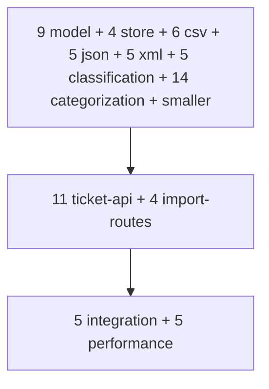

# Testing Guide

## Pyramid



## Running

```bash
npm test         # default — all Gemini calls mocked (91 tests)
npm run coverage # generates coverage/index.html (≥85%)
npm run test:live  # requires GEMINI_API_KEY in .env
```

## Test files

| File | Tests | Focus |
|---|---|---|
| `tests/ticket-model.test.js` | 9 | Validators (Zod) |
| `tests/store.test.js` | 4 | Map-backed store |
| `tests/ticket-service.test.js` | 6 | Service CRUD + filters |
| `tests/import-csv.test.js` | 6 | CSV parser |
| `tests/import-json.test.js` | 5 | JSON parser |
| `tests/import-xml.test.js` | 5 | XML parser |
| `tests/import-service.test.js` | 3 | Bulk-import orchestration |
| `tests/import-routes.test.js` | 4 | Import via HTTP |
| `tests/error-handler.test.js` | 3 | Centralized error handling |
| `tests/raw-body-parser.test.js` | 3 | CSV/XML/JSON raw body |
| `tests/classification-unit.test.js` | 5 | Service-level Gemini happy + failure paths |
| `tests/categorization.test.js` | 14 | All 6 categories + 4 priorities + error paths + manual override |
| `tests/ticket-api.test.js` | 11 | REST surface |
| `tests/integration.test.js` | 5 | End-to-end workflows |
| `tests/performance.test.js` | 5 | Throughput, p95, memory |
| `tests/smoke.test.js` | 1 | /health |
| `tests/logger.test.js` | 2 | Logger utility |
| `tests/live-classification.test.js` | 1 (skipped by default) | Real Gemini |

## Sample data locations

- `homework-2/tests/fixtures/` — used by parser tests
- `homework-2/demo/sample_tickets.{csv,json,xml}` — used in demo & sample-requests.http
- `homework-2/demo/invalid/` — broken files for negative demo

## Manual test checklist (post-implementation)

- [ ] `npm test` reports zero failures.
- [ ] `npm run coverage` shows lines/branches/functions/statements ≥ 85%.
- [ ] `npm start` boots and `curl /health` returns 200.
- [ ] Each cURL example in `API_REFERENCE.md` works against the running server.
- [ ] `npm run test:live` succeeds with a real `GEMINI_API_KEY`.
- [ ] `demo/sample-requests.http` runs end-to-end in REST Client / IntelliJ HTTP.

## Performance benchmarks

| Test | Threshold |
|---|---|
| 20 concurrent POST | < 1000 ms |
| CSV import (50 rows) | < 500 ms |
| GET filter over 1000 tickets | < 100 ms |
| Mocked classify p95 | < 50 ms |
| Heap delta after 1000 cycles | < 30 MB |
