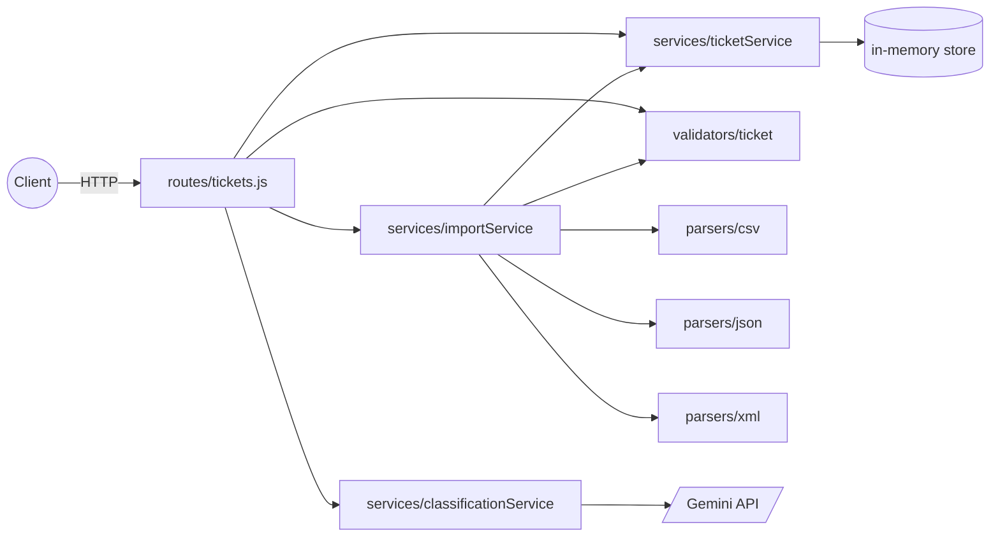
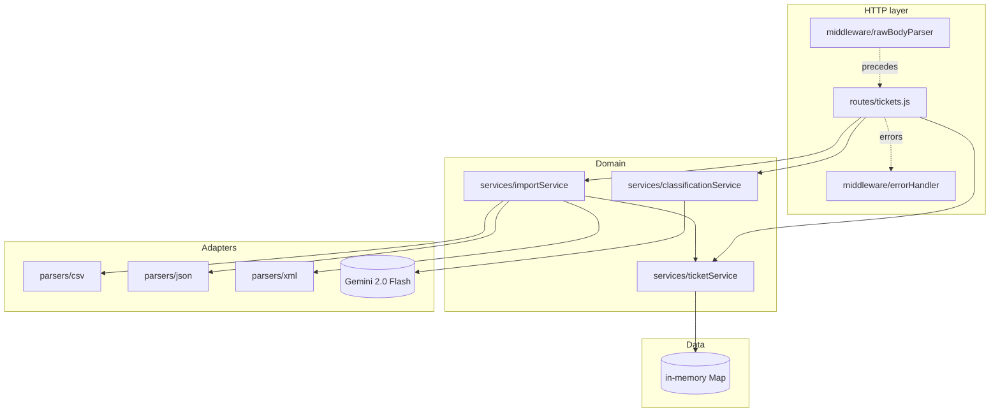
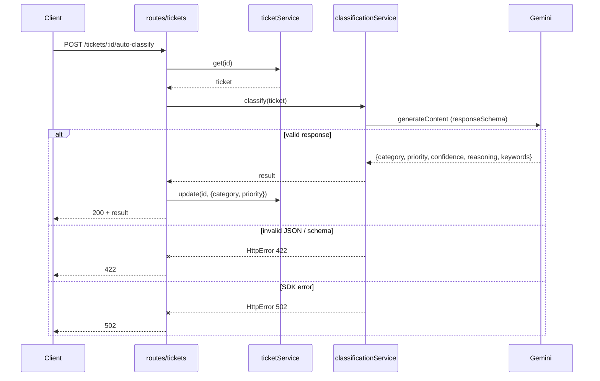
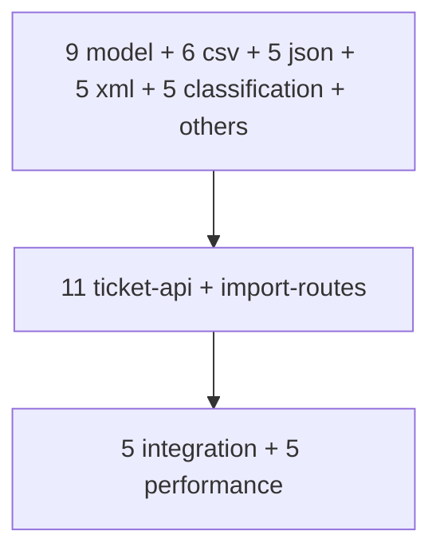

# Intelligent Customer Support System — Implementation Plan

> **For agentic workers:** REQUIRED SUB-SKILL: Use superpowers:subagent-driven-development (recommended) or superpowers:executing-plans to implement this plan task-by-task. Steps use checkbox (`- [ ]`) syntax for tracking.

**Goal:** Build a REST API for support tickets with multi-format import (CSV/JSON/XML), Gemini-only auto-classification, and ≥85% test coverage, matching `homework-2/TASKS.md` 1:1.

**Architecture:** Layered Express 5 app (routes → services → store/parsers/validators) with in-memory `Map<id, ticket>` storage. Auto-classification uses `@google/genai` (gemini-2.0-flash) with structured output and Zod-validated responses. No rule-based fallback. All Gemini calls are mocked in default `npm test`; one opt-in live test verifies real integration.

**Tech Stack:** Node.js ≥ 20 (ESM), Express 5.2, `@google/genai`, `zod`, `csv-parse`, `fast-xml-parser`, `dotenv`, Vitest 4 + `@vitest/coverage-v8`, `supertest`.

**Spec:** `homework-2/docs/superpowers/specs/2026-05-03-customer-support-design.md`

**Working directory:** All paths in this plan are **relative to repository root**. The codebase lives under `homework-2/`.

**Commit branch:** `homework-2-submission` (already created).

---

## Phase A — Foundation

### Task 1: Bootstrap project (package.json, dotfiles, install deps)

**Files:**
- Create: `homework-2/package.json`
- Create: `homework-2/.gitignore`
- Create: `homework-2/.env.example`
- Create: `homework-2/.eslintrc.cjs`
- Create: `homework-2/.prettierrc`
- Create: `homework-2/vitest.config.js`

- [ ] **Step 1: Write `homework-2/package.json`**

```json
{
  "name": "homework-2-customer-support",
  "version": "1.0.0",
  "private": true,
  "type": "module",
  "engines": { "node": ">=20" },
  "scripts": {
    "start": "node src/index.js",
    "dev": "node --watch src/index.js",
    "test": "vitest run --exclude tests/live-classification.test.js",
    "test:watch": "vitest --exclude tests/live-classification.test.js",
    "test:live": "RUN_LIVE=1 vitest run tests/live-classification.test.js",
    "coverage": "vitest run --coverage --exclude tests/live-classification.test.js",
    "lint": "eslint src tests",
    "format": "prettier --write src tests"
  },
  "dependencies": {
    "@google/genai": "^1.0.0",
    "csv-parse": "^5.5.6",
    "dotenv": "^16.4.5",
    "express": "^5.2.0",
    "fast-xml-parser": "^4.4.1",
    "zod": "^3.23.8"
  },
  "devDependencies": {
    "@vitest/coverage-v8": "^4.0.7",
    "eslint": "^9.0.0",
    "prettier": "^3.3.0",
    "supertest": "^7.0.0",
    "vitest": "^4.0.7"
  }
}
```

- [ ] **Step 2: Write `homework-2/.gitignore`**

```
node_modules/
coverage/
.env
.DS_Store
*.log
```

- [ ] **Step 3: Write `homework-2/.env.example`**

```
# Required for live classification (npm run test:live) and runtime auto-classify
GEMINI_API_KEY=
PORT=3000
NODE_ENV=development
```

- [ ] **Step 4: Write `homework-2/.eslintrc.cjs`**

```js
module.exports = {
  env: { node: true, es2024: true },
  parserOptions: { ecmaVersion: 2024, sourceType: 'module' },
  extends: ['eslint:recommended'],
  rules: { 'no-unused-vars': ['error', { argsIgnorePattern: '^_' }] },
  overrides: [{ files: ['tests/**/*.js'], env: { node: true } }]
};
```

- [ ] **Step 5: Write `homework-2/.prettierrc`**

```json
{ "singleQuote": true, "semi": true, "printWidth": 100, "trailingComma": "es5" }
```

- [ ] **Step 6: Write `homework-2/vitest.config.js`**

```js
import { defineConfig } from 'vitest/config';

export default defineConfig({
  test: {
    environment: 'node',
    globals: false,
    include: ['tests/**/*.test.js'],
    coverage: {
      provider: 'v8',
      reporter: ['text', 'html', 'lcov'],
      include: ['src/**/*.js'],
      exclude: ['src/index.js'],
      thresholds: { lines: 85, branches: 85, functions: 85, statements: 85 },
    },
  },
});
```

- [ ] **Step 7: Install dependencies**

```bash
cd homework-2 && npm install
```

Expected: `node_modules/` populated, `package-lock.json` generated, no fatal errors. If `@google/genai` reports a different latest version, adjust `package.json` to that version and reinstall.

- [ ] **Step 8: Commit**

```bash
git add homework-2/package.json homework-2/package-lock.json homework-2/.gitignore homework-2/.env.example homework-2/.eslintrc.cjs homework-2/.prettierrc homework-2/vitest.config.js
git commit -m "chore(homework-2): bootstrap project with deps, lint, vitest config"
```

---

### Task 2: Express app skeleton + smoke test

**Files:**
- Create: `homework-2/src/app.js`
- Create: `homework-2/src/index.js`
- Create: `homework-2/src/config.js`
- Create: `homework-2/tests/smoke.test.js`

- [ ] **Step 1: Write the failing smoke test**

`homework-2/tests/smoke.test.js`:

```js
import { describe, it, expect } from 'vitest';
import request from 'supertest';
import { createApp } from '../src/app.js';

describe('smoke', () => {
  it('GET /health returns 200 and {status:"ok"}', async () => {
    const res = await request(createApp()).get('/health');
    expect(res.status).toBe(200);
    expect(res.body).toEqual({ status: 'ok' });
  });
});
```

- [ ] **Step 2: Run test to verify it fails**

```bash
cd homework-2 && npm test -- tests/smoke.test.js
```

Expected: FAIL — cannot resolve `../src/app.js`.

- [ ] **Step 3: Write `homework-2/src/config.js`**

```js
import 'dotenv/config';

export const config = {
  port: Number(process.env.PORT) || 3000,
  geminiApiKey: process.env.GEMINI_API_KEY || '',
  env: process.env.NODE_ENV || 'development',
};
```

- [ ] **Step 4: Write `homework-2/src/app.js`**

```js
import express from 'express';

export function createApp() {
  const app = express();
  app.use(express.json({ limit: '5mb' }));
  app.get('/health', (_req, res) => res.status(200).json({ status: 'ok' }));
  return app;
}
```

- [ ] **Step 5: Write `homework-2/src/index.js`**

```js
import { createApp } from './app.js';
import { config } from './config.js';

const app = createApp();
app.listen(config.port, () => {
  console.log(`[server] listening on :${config.port}`);
});
```

- [ ] **Step 6: Run test to verify it passes**

```bash
cd homework-2 && npm test -- tests/smoke.test.js
```

Expected: 1 passed.

- [ ] **Step 7: Commit**

```bash
git add homework-2/src homework-2/tests/smoke.test.js
git commit -m "feat(homework-2): add Express app skeleton with /health and smoke test"
```

---

### Task 3: Logger utility

**Files:**
- Create: `homework-2/src/utils/logger.js`
- Create: `homework-2/tests/logger.test.js`

- [ ] **Step 1: Write the failing test**

`homework-2/tests/logger.test.js`:

```js
import { describe, it, expect, vi, afterEach } from 'vitest';
import { logger } from '../src/utils/logger.js';

afterEach(() => vi.restoreAllMocks());

describe('logger', () => {
  it('info() writes JSON line to console.log with prefix', () => {
    const spy = vi.spyOn(console, 'log').mockImplementation(() => {});
    logger.info('[classify]', { ticket_id: 'abc' });
    expect(spy).toHaveBeenCalledOnce();
    const arg = spy.mock.calls[0][0];
    expect(arg).toContain('[classify]');
    expect(arg).toContain('"ticket_id":"abc"');
  });

  it('error() writes to console.error', () => {
    const spy = vi.spyOn(console, 'error').mockImplementation(() => {});
    logger.error('[boom]', { msg: 'x' });
    expect(spy).toHaveBeenCalledOnce();
  });
});
```

- [ ] **Step 2: Run test to verify it fails**

```bash
cd homework-2 && npm test -- tests/logger.test.js
```

Expected: FAIL — cannot resolve `../src/utils/logger.js`.

- [ ] **Step 3: Write `homework-2/src/utils/logger.js`**

```js
function fmt(prefix, payload) {
  return `${prefix} ${JSON.stringify(payload)}`;
}

export const logger = {
  info: (prefix, payload) => console.log(fmt(prefix, payload)),
  warn: (prefix, payload) => console.warn(fmt(prefix, payload)),
  error: (prefix, payload) => console.error(fmt(prefix, payload)),
};
```

- [ ] **Step 4: Run test**

```bash
cd homework-2 && npm test -- tests/logger.test.js
```

Expected: 2 passed.

- [ ] **Step 5: Commit**

```bash
git add homework-2/src/utils/logger.js homework-2/tests/logger.test.js
git commit -m "feat(homework-2): add logger utility"
```

---

## Phase B — Domain layer

### Task 4: Zod validators (ticket-model.test.js → 9 tests)

**Files:**
- Create: `homework-2/src/validators/ticket.js`
- Create: `homework-2/tests/ticket-model.test.js`

- [ ] **Step 1: Write all 9 failing tests**

`homework-2/tests/ticket-model.test.js`:

```js
import { describe, it, expect } from 'vitest';
import { createTicketSchema, updateTicketSchema, importRowSchema } from '../src/validators/ticket.js';

const valid = {
  customer_id: 'C-1',
  customer_email: 'a@b.co',
  customer_name: 'Ada',
  subject: 'login broken',
  description: 'cannot sign in for two days',
  metadata: { source: 'web_form' },
};

describe('createTicketSchema', () => {
  it('1. accepts a minimal valid payload', () => {
    expect(() => createTicketSchema.parse(valid)).not.toThrow();
  });

  it('2. rejects invalid email', () => {
    expect(() => createTicketSchema.parse({ ...valid, customer_email: 'nope' })).toThrow();
  });

  it('3. rejects subject longer than 200 chars', () => {
    expect(() => createTicketSchema.parse({ ...valid, subject: 'x'.repeat(201) })).toThrow();
  });

  it('4. rejects description shorter than 10 chars', () => {
    expect(() => createTicketSchema.parse({ ...valid, description: 'short' })).toThrow();
  });

  it('5. rejects unknown metadata.source', () => {
    expect(() =>
      createTicketSchema.parse({ ...valid, metadata: { source: 'pigeon' } })
    ).toThrow();
  });

  it('6. accepts optional tags array', () => {
    const parsed = createTicketSchema.parse({ ...valid, tags: ['urgent', 'vip'] });
    expect(parsed.tags).toEqual(['urgent', 'vip']);
  });

  it('7. rejects when subject missing', () => {
    const { subject: _drop, ...rest } = valid;
    expect(() => createTicketSchema.parse(rest)).toThrow();
  });
});

describe('updateTicketSchema', () => {
  it('8. accepts partial update with only category', () => {
    expect(() => updateTicketSchema.parse({ category: 'billing_question' })).not.toThrow();
  });
});

describe('importRowSchema', () => {
  it('9. parses an import row with priority and category present', () => {
    const row = { ...valid, category: 'bug_report', priority: 'high' };
    const parsed = importRowSchema.parse(row);
    expect(parsed.category).toBe('bug_report');
    expect(parsed.priority).toBe('high');
  });
});
```

- [ ] **Step 2: Run tests to verify all 9 fail**

```bash
cd homework-2 && npm test -- tests/ticket-model.test.js
```

Expected: 9 failed (cannot resolve validators module).

- [ ] **Step 3: Write `homework-2/src/validators/ticket.js`**

```js
import { z } from 'zod';

export const CATEGORY = [
  'account_access',
  'technical_issue',
  'billing_question',
  'feature_request',
  'bug_report',
  'other',
];
export const PRIORITY = ['urgent', 'high', 'medium', 'low'];
export const STATUS = ['new', 'in_progress', 'waiting_customer', 'resolved', 'closed'];
export const SOURCE = ['web_form', 'email', 'api', 'chat', 'phone'];
export const DEVICE = ['desktop', 'mobile', 'tablet'];

const metadataSchema = z.object({
  source: z.enum(SOURCE),
  browser: z.string().optional(),
  device_type: z.enum(DEVICE).optional(),
});

const baseFields = {
  customer_id: z.string().min(1),
  customer_email: z.string().email(),
  customer_name: z.string().min(1),
  subject: z.string().min(1).max(200),
  description: z.string().min(10).max(2000),
  category: z.enum(CATEGORY).optional(),
  priority: z.enum(PRIORITY).optional(),
  status: z.enum(STATUS).optional(),
  assigned_to: z.string().nullable().optional(),
  tags: z.array(z.string()).optional(),
  metadata: metadataSchema,
};

export const createTicketSchema = z.object(baseFields).strict();

export const updateTicketSchema = z
  .object({
    customer_id: z.string().min(1).optional(),
    customer_email: z.string().email().optional(),
    customer_name: z.string().min(1).optional(),
    subject: z.string().min(1).max(200).optional(),
    description: z.string().min(10).max(2000).optional(),
    category: z.enum(CATEGORY).optional(),
    priority: z.enum(PRIORITY).optional(),
    status: z.enum(STATUS).optional(),
    assigned_to: z.string().nullable().optional(),
    tags: z.array(z.string()).optional(),
    metadata: metadataSchema.partial().optional(),
  })
  .strict();

export const importRowSchema = createTicketSchema;

export const classificationResultSchema = z.object({
  category: z.enum(CATEGORY),
  priority: z.enum(PRIORITY),
  confidence: z.number().min(0).max(1),
  reasoning: z.string(),
  keywords: z.array(z.string()),
});
```

- [ ] **Step 4: Run tests**

```bash
cd homework-2 && npm test -- tests/ticket-model.test.js
```

Expected: 9 passed.

- [ ] **Step 5: Commit**

```bash
git add homework-2/src/validators/ticket.js homework-2/tests/ticket-model.test.js
git commit -m "feat(homework-2): add Zod validators with 9 model tests"
```

---

### Task 5: In-memory store

**Files:**
- Create: `homework-2/src/store/tickets.js`
- Create: `homework-2/tests/store.test.js`

- [ ] **Step 1: Write failing tests**

`homework-2/tests/store.test.js`:

```js
import { describe, it, expect, beforeEach } from 'vitest';
import { ticketStore } from '../src/store/tickets.js';

beforeEach(() => ticketStore.reset());

describe('ticketStore', () => {
  it('save() returns the saved ticket and get() retrieves it', () => {
    ticketStore.save({ id: 'a', subject: 's' });
    expect(ticketStore.get('a')).toEqual({ id: 'a', subject: 's' });
  });

  it('get() returns undefined for missing id', () => {
    expect(ticketStore.get('missing')).toBeUndefined();
  });

  it('list() returns all', () => {
    ticketStore.save({ id: 'a' });
    ticketStore.save({ id: 'b' });
    expect(ticketStore.list()).toHaveLength(2);
  });

  it('delete() removes', () => {
    ticketStore.save({ id: 'a' });
    expect(ticketStore.delete('a')).toBe(true);
    expect(ticketStore.get('a')).toBeUndefined();
    expect(ticketStore.delete('a')).toBe(false);
  });
});
```

- [ ] **Step 2: Run test, verify fail**

```bash
cd homework-2 && npm test -- tests/store.test.js
```

Expected: FAIL.

- [ ] **Step 3: Write `homework-2/src/store/tickets.js`**

```js
const map = new Map();

export const ticketStore = {
  save(ticket) {
    map.set(ticket.id, ticket);
    return ticket;
  },
  get(id) {
    return map.get(id);
  },
  list() {
    return Array.from(map.values());
  },
  delete(id) {
    return map.delete(id);
  },
  reset() {
    map.clear();
  },
};
```

- [ ] **Step 4: Run, verify pass**

```bash
cd homework-2 && npm test -- tests/store.test.js
```

Expected: 4 passed.

- [ ] **Step 5: Commit**

```bash
git add homework-2/src/store/tickets.js homework-2/tests/store.test.js
git commit -m "feat(homework-2): add in-memory ticket store"
```

---

### Task 6: ticketService — create / get / list / update / delete + filtering

**Files:**
- Create: `homework-2/src/services/ticketService.js`
- Create: `homework-2/tests/ticket-service.test.js`

- [ ] **Step 1: Write failing tests**

`homework-2/tests/ticket-service.test.js`:

```js
import { describe, it, expect, beforeEach } from 'vitest';
import { ticketService } from '../src/services/ticketService.js';
import { ticketStore } from '../src/store/tickets.js';

const valid = {
  customer_id: 'C-1',
  customer_email: 'a@b.co',
  customer_name: 'Ada',
  subject: 'login broken',
  description: 'cannot sign in for two days',
  metadata: { source: 'web_form' },
};

beforeEach(() => ticketStore.reset());

describe('ticketService', () => {
  it('create() assigns UUID, status=new, timestamps, defaults', () => {
    const t = ticketService.create(valid);
    expect(t.id).toMatch(/^[0-9a-f-]{36}$/);
    expect(t.status).toBe('new');
    expect(t.priority).toBe('medium');
    expect(t.category).toBe('other');
    expect(t.tags).toEqual([]);
    expect(t.assigned_to).toBeNull();
    expect(t.resolved_at).toBeNull();
    expect(typeof t.created_at).toBe('string');
    expect(t.updated_at).toBe(t.created_at);
  });

  it('update() patches fields and refreshes updated_at', async () => {
    const t = ticketService.create(valid);
    await new Promise((r) => setTimeout(r, 5));
    const u = ticketService.update(t.id, { subject: 'changed' });
    expect(u.subject).toBe('changed');
    expect(u.updated_at).not.toBe(t.created_at);
  });

  it('update() sets resolved_at when status moves to resolved', () => {
    const t = ticketService.create(valid);
    const u = ticketService.update(t.id, { status: 'resolved' });
    expect(u.resolved_at).not.toBeNull();
  });

  it('update() returns null for missing id', () => {
    expect(ticketService.update('nope', { subject: 'x' })).toBeNull();
  });

  it('list() filters by category, priority, status, assigned_to, tag, from, to', () => {
    const a = ticketService.create({ ...valid, subject: 'a', description: 'desc desc desc' });
    ticketService.update(a.id, { category: 'billing_question', priority: 'high', tags: ['vip'] });
    const b = ticketService.create({ ...valid, subject: 'b', description: 'desc desc desc' });
    ticketService.update(b.id, { category: 'bug_report', priority: 'low' });

    expect(ticketService.list({ category: 'billing_question' })).toHaveLength(1);
    expect(ticketService.list({ priority: 'high' })).toHaveLength(1);
    expect(ticketService.list({ tag: 'vip' })).toHaveLength(1);
    expect(ticketService.list({ status: 'new' })).toHaveLength(2);
    expect(ticketService.list({ from: '1970-01-01', to: '2999-12-31' })).toHaveLength(2);
    expect(ticketService.list({ from: '2999-01-01' })).toHaveLength(0);
  });

  it('remove() returns boolean', () => {
    const t = ticketService.create(valid);
    expect(ticketService.remove(t.id)).toBe(true);
    expect(ticketService.remove(t.id)).toBe(false);
  });
});
```

- [ ] **Step 2: Run test, verify fail**

```bash
cd homework-2 && npm test -- tests/ticket-service.test.js
```

Expected: FAIL — cannot resolve service module.

- [ ] **Step 3: Write `homework-2/src/services/ticketService.js`**

```js
import { randomUUID } from 'node:crypto';
import { ticketStore } from '../store/tickets.js';

function nowIso() {
  return new Date().toISOString();
}

function newTicket(input) {
  const ts = nowIso();
  return {
    id: randomUUID(),
    customer_id: input.customer_id,
    customer_email: input.customer_email,
    customer_name: input.customer_name,
    subject: input.subject,
    description: input.description,
    category: input.category ?? 'other',
    priority: input.priority ?? 'medium',
    status: input.status ?? 'new',
    created_at: ts,
    updated_at: ts,
    resolved_at: null,
    assigned_to: input.assigned_to ?? null,
    tags: input.tags ?? [],
    metadata: { ...input.metadata },
  };
}

export const ticketService = {
  create(input) {
    return ticketStore.save(newTicket(input));
  },

  get(id) {
    return ticketStore.get(id);
  },

  list(filters = {}) {
    let items = ticketStore.list();
    const { category, priority, status, assigned_to, tag, from, to } = filters;
    if (category) items = items.filter((t) => t.category === category);
    if (priority) items = items.filter((t) => t.priority === priority);
    if (status) items = items.filter((t) => t.status === status);
    if (assigned_to) items = items.filter((t) => t.assigned_to === assigned_to);
    if (tag) items = items.filter((t) => Array.isArray(t.tags) && t.tags.includes(tag));
    if (from) items = items.filter((t) => t.created_at >= from);
    if (to) items = items.filter((t) => t.created_at <= to);
    return items;
  },

  update(id, patch) {
    const existing = ticketStore.get(id);
    if (!existing) return null;
    const merged = {
      ...existing,
      ...patch,
      metadata: patch.metadata ? { ...existing.metadata, ...patch.metadata } : existing.metadata,
      updated_at: nowIso(),
    };
    if (patch.status === 'resolved' && !existing.resolved_at) {
      merged.resolved_at = merged.updated_at;
    }
    return ticketStore.save(merged);
  },

  remove(id) {
    return ticketStore.delete(id);
  },
};
```

- [ ] **Step 4: Run, verify pass**

```bash
cd homework-2 && npm test -- tests/ticket-service.test.js
```

Expected: 6 passed.

- [ ] **Step 5: Commit**

```bash
git add homework-2/src/services/ticketService.js homework-2/tests/ticket-service.test.js
git commit -m "feat(homework-2): add ticketService with CRUD and filters"
```

---

## Phase C — Parsers and import

### Task 7: CSV parser (import-csv.test.js → 6 tests)

**Files:**
- Create: `homework-2/src/parsers/csv.js`
- Create: `homework-2/tests/import-csv.test.js`
- Create: `homework-2/tests/fixtures/tickets-valid.csv`
- Create: `homework-2/tests/fixtures/tickets-bom.csv`
- Create: `homework-2/tests/fixtures/tickets-malformed.csv`
- Create: `homework-2/tests/fixtures/tickets-mixed.csv`

- [ ] **Step 1: Create fixture files**

`homework-2/tests/fixtures/tickets-valid.csv`:

```csv
customer_id,customer_email,customer_name,subject,description,metadata.source
C-1,a@b.co,Ada,login broken,cannot sign in for two days,web_form
C-2,c@d.co,Bob,billing question,charged twice for the plan,email
```

`homework-2/tests/fixtures/tickets-bom.csv`:

```csv
customer_id,customer_email,customer_name,subject,description,metadata.source
C-3,e@f.co,Cy,bom test,description longer than ten,api
```

(Note: the leading `` is the BOM character `U+FEFF` — the test asserts the parser strips it.)

`homework-2/tests/fixtures/tickets-malformed.csv`:

```csv
customer_id,customer_email,"customer_name
C-1,a@b.co,Ada
```

`homework-2/tests/fixtures/tickets-mixed.csv`:

```csv
customer_id,customer_email,customer_name,subject,description,metadata.source
C-1,a@b.co,Ada,login broken,cannot sign in for two days,web_form
C-2,not-an-email,Bob,billing,charged twice for the plan,email
```

- [ ] **Step 2: Write failing tests**

`homework-2/tests/import-csv.test.js`:

```js
import { describe, it, expect } from 'vitest';
import { readFileSync } from 'node:fs';
import { fileURLToPath } from 'node:url';
import { dirname, resolve } from 'node:path';
import { parseCsv } from '../src/parsers/csv.js';

const here = dirname(fileURLToPath(import.meta.url));
const fx = (name) => readFileSync(resolve(here, 'fixtures', name), 'utf8');

describe('parseCsv', () => {
  it('1. parses valid two-row CSV with nested metadata.source', () => {
    const rows = parseCsv(fx('tickets-valid.csv'));
    expect(rows).toHaveLength(2);
    expect(rows[0].customer_email).toBe('a@b.co');
    expect(rows[0].metadata.source).toBe('web_form');
  });

  it('2. throws meaningful error on missing required column', () => {
    const csv = 'customer_email,customer_name\na@b.co,Ada\n';
    expect(() => parseCsv(csv)).toThrow(/customer_id/);
  });

  it('3. throws on malformed quote', () => {
    expect(() => parseCsv(fx('tickets-malformed.csv'))).toThrow();
  });

  it('4. strips BOM from first column header', () => {
    const rows = parseCsv(fx('tickets-bom.csv'));
    expect(rows[0].customer_id).toBe('C-3');
  });

  it('5. returns empty array for headers-only file', () => {
    const rows = parseCsv('customer_id,customer_email,customer_name,subject,description,metadata.source\n');
    expect(rows).toEqual([]);
  });

  it('6. parses mixed file (downstream service decides validity)', () => {
    const rows = parseCsv(fx('tickets-mixed.csv'));
    expect(rows).toHaveLength(2);
    expect(rows[1].customer_email).toBe('not-an-email');
  });
});
```

- [ ] **Step 3: Run, verify fail**

```bash
cd homework-2 && npm test -- tests/import-csv.test.js
```

Expected: FAIL.

- [ ] **Step 4: Write `homework-2/src/parsers/csv.js`**

```js
import { parse } from 'csv-parse/sync';

const REQUIRED = ['customer_id', 'customer_email', 'customer_name', 'subject', 'description', 'metadata.source'];

function nest(flatRow) {
  const out = {};
  for (const [key, value] of Object.entries(flatRow)) {
    if (key.includes('.')) {
      const [head, tail] = key.split('.');
      out[head] = out[head] || {};
      out[head][tail] = value;
    } else {
      out[key] = value;
    }
  }
  return out;
}

export function parseCsv(text) {
  let records;
  try {
    records = parse(text, { columns: true, bom: true, skip_empty_lines: true, trim: true });
  } catch (err) {
    throw new Error(`CSV parse failed: ${err.message}`);
  }

  if (records.length === 0) return [];

  for (const required of REQUIRED) {
    if (!(required in records[0])) {
      throw new Error(`CSV missing required column: ${required}`);
    }
  }

  return records.map(nest);
}
```

- [ ] **Step 5: Run tests, verify all 6 pass**

```bash
cd homework-2 && npm test -- tests/import-csv.test.js
```

Expected: 6 passed.

- [ ] **Step 6: Commit**

```bash
git add homework-2/src/parsers/csv.js homework-2/tests/import-csv.test.js homework-2/tests/fixtures/tickets-valid.csv homework-2/tests/fixtures/tickets-bom.csv homework-2/tests/fixtures/tickets-malformed.csv homework-2/tests/fixtures/tickets-mixed.csv
git commit -m "feat(homework-2): CSV parser with 6 tests and fixtures"
```

---

### Task 8: JSON parser (import-json.test.js → 5 tests)

**Files:**
- Create: `homework-2/src/parsers/json.js`
- Create: `homework-2/tests/import-json.test.js`

- [ ] **Step 1: Write failing tests**

`homework-2/tests/import-json.test.js`:

```js
import { describe, it, expect } from 'vitest';
import { parseJson } from '../src/parsers/json.js';

const valid = {
  customer_id: 'C-1',
  customer_email: 'a@b.co',
  customer_name: 'Ada',
  subject: 'login broken',
  description: 'cannot sign in for two days',
  metadata: { source: 'web_form' },
};

describe('parseJson', () => {
  it('1. parses valid array of tickets', () => {
    const rows = parseJson(JSON.stringify([valid, valid]));
    expect(rows).toHaveLength(2);
    expect(rows[0].customer_email).toBe('a@b.co');
  });

  it('2. throws when root is a single object', () => {
    expect(() => parseJson(JSON.stringify(valid))).toThrow(/array/);
  });

  it('3. throws on malformed JSON', () => {
    expect(() => parseJson('{not json')).toThrow(/JSON parse failed/);
  });

  it('4. returns empty array for "[]"', () => {
    expect(parseJson('[]')).toEqual([]);
  });

  it('5. preserves an element even if it would later fail validation', () => {
    const broken = { ...valid, customer_email: 'nope' };
    const rows = parseJson(JSON.stringify([broken]));
    expect(rows[0].customer_email).toBe('nope');
  });
});
```

- [ ] **Step 2: Run, verify fail**

```bash
cd homework-2 && npm test -- tests/import-json.test.js
```

Expected: FAIL.

- [ ] **Step 3: Write `homework-2/src/parsers/json.js`**

```js
export function parseJson(text) {
  let data;
  try {
    data = JSON.parse(text);
  } catch (err) {
    throw new Error(`JSON parse failed: ${err.message}`);
  }
  if (!Array.isArray(data)) {
    throw new Error('JSON root must be an array of tickets');
  }
  return data;
}
```

- [ ] **Step 4: Run, verify pass**

```bash
cd homework-2 && npm test -- tests/import-json.test.js
```

Expected: 5 passed.

- [ ] **Step 5: Commit**

```bash
git add homework-2/src/parsers/json.js homework-2/tests/import-json.test.js
git commit -m "feat(homework-2): JSON parser with 5 tests"
```

---

### Task 9: XML parser (import-xml.test.js → 5 tests)

**Files:**
- Create: `homework-2/src/parsers/xml.js`
- Create: `homework-2/tests/import-xml.test.js`
- Create: `homework-2/tests/fixtures/tickets-valid.xml`
- Create: `homework-2/tests/fixtures/tickets-empty.xml`

- [ ] **Step 1: Create fixture files**

`homework-2/tests/fixtures/tickets-valid.xml`:

```xml
<?xml version="1.0" encoding="UTF-8"?>
<tickets>
  <ticket>
    <customer_id>C-1</customer_id>
    <customer_email>a@b.co</customer_email>
    <customer_name>Ada</customer_name>
    <subject>login broken</subject>
    <description>cannot sign in for two days</description>
    <metadata>
      <source>web_form</source>
    </metadata>
  </ticket>
  <ticket>
    <customer_id>C-2</customer_id>
    <customer_email>c@d.co</customer_email>
    <customer_name>Bob</customer_name>
    <subject>billing</subject>
    <description>charged twice this month</description>
    <metadata>
      <source>email</source>
    </metadata>
  </ticket>
</tickets>
```

`homework-2/tests/fixtures/tickets-empty.xml`:

```xml
<?xml version="1.0" encoding="UTF-8"?>
<tickets/>
```

- [ ] **Step 2: Write failing tests**

`homework-2/tests/import-xml.test.js`:

```js
import { describe, it, expect } from 'vitest';
import { readFileSync } from 'node:fs';
import { fileURLToPath } from 'node:url';
import { dirname, resolve } from 'node:path';
import { parseXml } from '../src/parsers/xml.js';

const here = dirname(fileURLToPath(import.meta.url));
const fx = (name) => readFileSync(resolve(here, 'fixtures', name), 'utf8');

describe('parseXml', () => {
  it('1. parses valid <tickets><ticket/></tickets> structure', () => {
    const rows = parseXml(fx('tickets-valid.xml'));
    expect(rows).toHaveLength(2);
    expect(rows[0].customer_email).toBe('a@b.co');
    expect(rows[0].metadata.source).toBe('web_form');
  });

  it('2. throws on malformed XML', () => {
    expect(() => parseXml('<tickets><ticket></tickets>')).toThrow();
  });

  it('3. throws when root element is not <tickets>', () => {
    const xml = '<?xml version="1.0"?><items><item/></items>';
    expect(() => parseXml(xml)).toThrow(/root/);
  });

  it('4. handles XML with default namespace by ignoring it', () => {
    const xml =
      '<?xml version="1.0"?><tickets xmlns="http://example.com"><ticket><customer_id>C-9</customer_id><customer_email>x@y.z</customer_email><customer_name>N</customer_name><subject>s</subject><description>desc desc desc</description><metadata><source>api</source></metadata></ticket></tickets>';
    const rows = parseXml(xml);
    expect(rows[0].customer_id).toBe('C-9');
  });

  it('5. returns empty array for <tickets/>', () => {
    expect(parseXml(fx('tickets-empty.xml'))).toEqual([]);
  });
});
```

- [ ] **Step 3: Run, verify fail**

```bash
cd homework-2 && npm test -- tests/import-xml.test.js
```

Expected: FAIL.

- [ ] **Step 4: Write `homework-2/src/parsers/xml.js`**

```js
import { XMLParser, XMLValidator } from 'fast-xml-parser';

const parser = new XMLParser({
  ignoreAttributes: true,
  parseTagValue: false,
  trimValues: true,
});

export function parseXml(text) {
  const validation = XMLValidator.validate(text);
  if (validation !== true) {
    throw new Error(`XML parse failed: ${validation.err?.msg ?? 'invalid XML'}`);
  }
  const obj = parser.parse(text);
  if (!('tickets' in obj)) {
    throw new Error('XML root must be <tickets>');
  }
  const inner = obj.tickets;
  if (inner == null || inner === '') return [];
  const list = Array.isArray(inner.ticket) ? inner.ticket : inner.ticket ? [inner.ticket] : [];
  return list;
}
```

- [ ] **Step 5: Run, verify pass**

```bash
cd homework-2 && npm test -- tests/import-xml.test.js
```

Expected: 5 passed.

- [ ] **Step 6: Commit**

```bash
git add homework-2/src/parsers/xml.js homework-2/tests/import-xml.test.js homework-2/tests/fixtures/tickets-valid.xml homework-2/tests/fixtures/tickets-empty.xml
git commit -m "feat(homework-2): XML parser with 5 tests"
```

---

### Task 10: importService (orchestrates parsers + validation + create-many)

**Files:**
- Create: `homework-2/src/services/importService.js`
- Create: `homework-2/tests/import-service.test.js`

- [ ] **Step 1: Write failing tests**

`homework-2/tests/import-service.test.js`:

```js
import { describe, it, expect, beforeEach } from 'vitest';
import { importService } from '../src/services/importService.js';
import { ticketStore } from '../src/store/tickets.js';

beforeEach(() => ticketStore.reset());

const validJson = JSON.stringify([
  {
    customer_id: 'C-1',
    customer_email: 'a@b.co',
    customer_name: 'Ada',
    subject: 'login broken',
    description: 'cannot sign in for two days',
    metadata: { source: 'web_form' },
  },
  {
    customer_id: 'C-2',
    customer_email: 'not-an-email',
    customer_name: 'Bob',
    subject: 'billing',
    description: 'charged twice this month',
    metadata: { source: 'email' },
  },
]);

describe('importService', () => {
  it('returns summary with successful and failed counts', async () => {
    const result = await importService.importBulk({ format: 'json', body: validJson });
    expect(result.total).toBe(2);
    expect(result.successful).toBe(1);
    expect(result.failed).toHaveLength(1);
    expect(result.failed[0].row).toBe(1);
    expect(result.failed[0].error).toMatch(/email/i);
  });

  it('throws on unknown format', async () => {
    await expect(importService.importBulk({ format: 'yaml', body: '' })).rejects.toThrow(/format/);
  });

  it('throws on completely malformed body', async () => {
    await expect(importService.importBulk({ format: 'json', body: '{not json' })).rejects.toThrow(
      /JSON parse failed/
    );
  });
});
```

- [ ] **Step 2: Run, verify fail**

```bash
cd homework-2 && npm test -- tests/import-service.test.js
```

Expected: FAIL.

- [ ] **Step 3: Write `homework-2/src/services/importService.js`**

```js
import { parseCsv } from '../parsers/csv.js';
import { parseJson } from '../parsers/json.js';
import { parseXml } from '../parsers/xml.js';
import { ticketService } from './ticketService.js';
import { importRowSchema } from '../validators/ticket.js';

const PARSERS = { csv: parseCsv, json: parseJson, xml: parseXml };

export const importService = {
  async importBulk({ format, body, onCreated }) {
    const parser = PARSERS[format];
    if (!parser) throw new Error(`Unsupported format: ${format}`);

    const rows = parser(body);
    const failed = [];
    let successful = 0;

    for (let i = 0; i < rows.length; i++) {
      const parsed = importRowSchema.safeParse(rows[i]);
      if (!parsed.success) {
        failed.push({ row: i, error: parsed.error.issues.map((x) => `${x.path.join('.')}: ${x.message}`).join('; ') });
        continue;
      }
      const created = ticketService.create(parsed.data);
      if (onCreated) {
        try {
          await onCreated(created);
        } catch (err) {
          failed.push({ row: i, error: `post-create: ${err.message}` });
        }
      }
      successful++;
    }

    return { total: rows.length, successful, failed };
  },
};
```

- [ ] **Step 4: Run, verify pass**

```bash
cd homework-2 && npm test -- tests/import-service.test.js
```

Expected: 3 passed.

- [ ] **Step 5: Commit**

```bash
git add homework-2/src/services/importService.js homework-2/tests/import-service.test.js
git commit -m "feat(homework-2): importService orchestrates parsers + validation"
```

---

## Phase D — HTTP layer

### Task 11: errorHandler middleware

**Files:**
- Create: `homework-2/src/middleware/errorHandler.js`
- Create: `homework-2/src/errors.js`
- Create: `homework-2/tests/error-handler.test.js`

- [ ] **Step 1: Write failing tests**

`homework-2/tests/error-handler.test.js`:

```js
import { describe, it, expect } from 'vitest';
import express from 'express';
import request from 'supertest';
import { ZodError } from 'zod';
import { errorHandler } from '../src/middleware/errorHandler.js';
import { HttpError } from '../src/errors.js';
import { createTicketSchema } from '../src/validators/ticket.js';

function appWith(thrower) {
  const app = express();
  app.use(express.json());
  app.get('/boom', (_req, _res, _next) => thrower());
  app.use(errorHandler);
  return app;
}

describe('errorHandler', () => {
  it('Zod errors → 400 with details', async () => {
    const res = await request(
      appWith(() => createTicketSchema.parse({}))
    ).get('/boom');
    expect(res.status).toBe(400);
    expect(res.body.error).toBe('Validation failed');
    expect(Array.isArray(res.body.details)).toBe(true);
  });

  it('HttpError → custom status', async () => {
    const res = await request(
      appWith(() => {
        throw new HttpError(404, 'Ticket not found');
      })
    ).get('/boom');
    expect(res.status).toBe(404);
    expect(res.body).toEqual({ error: 'Ticket not found' });
  });

  it('Unknown error → 500', async () => {
    const res = await request(
      appWith(() => {
        throw new Error('boom');
      })
    ).get('/boom');
    expect(res.status).toBe(500);
    expect(res.body.error).toBe('Internal server error');
  });
});
```

- [ ] **Step 2: Run, verify fail**

```bash
cd homework-2 && npm test -- tests/error-handler.test.js
```

Expected: FAIL.

- [ ] **Step 3: Write `homework-2/src/errors.js`**

```js
export class HttpError extends Error {
  constructor(status, message, details) {
    super(message);
    this.status = status;
    this.details = details;
  }
}
```

- [ ] **Step 4: Write `homework-2/src/middleware/errorHandler.js`**

```js
import { ZodError } from 'zod';
import { HttpError } from '../errors.js';

export function errorHandler(err, _req, res, _next) {
  if (err instanceof ZodError) {
    return res.status(400).json({
      error: 'Validation failed',
      details: err.issues.map((i) => ({ field: i.path.join('.') || '_root', message: i.message })),
    });
  }
  if (err instanceof HttpError) {
    const body = { error: err.message };
    if (err.details) body.details = err.details;
    return res.status(err.status).json(body);
  }
  return res.status(500).json({ error: 'Internal server error' });
}
```

- [ ] **Step 5: Run, verify pass**

```bash
cd homework-2 && npm test -- tests/error-handler.test.js
```

Expected: 3 passed.

- [ ] **Step 6: Commit**

```bash
git add homework-2/src/errors.js homework-2/src/middleware/errorHandler.js homework-2/tests/error-handler.test.js
git commit -m "feat(homework-2): centralized error handler with Zod + HttpError support"
```

---

### Task 12: rawBodyParser middleware

**Files:**
- Create: `homework-2/src/middleware/rawBodyParser.js`
- Create: `homework-2/tests/raw-body-parser.test.js`

- [ ] **Step 1: Write failing tests**

`homework-2/tests/raw-body-parser.test.js`:

```js
import { describe, it, expect } from 'vitest';
import express from 'express';
import request from 'supertest';
import { rawBodyParser } from '../src/middleware/rawBodyParser.js';

function app() {
  const a = express();
  a.use(rawBodyParser);
  a.post('/echo', (req, res) => res.json({ body: req.rawBody, type: typeof req.rawBody }));
  return a;
}

describe('rawBodyParser', () => {
  it('captures text/csv body as string', async () => {
    const res = await request(app())
      .post('/echo')
      .set('Content-Type', 'text/csv')
      .send('a,b\n1,2');
    expect(res.body.type).toBe('string');
    expect(res.body.body).toContain('a,b');
  });

  it('captures application/xml body', async () => {
    const res = await request(app())
      .post('/echo')
      .set('Content-Type', 'application/xml')
      .send('<x/>');
    expect(res.body.body).toBe('<x/>');
  });

  it('captures application/json body as raw text', async () => {
    const res = await request(app())
      .post('/echo')
      .set('Content-Type', 'application/json')
      .send('[{"a":1}]');
    expect(res.body.body).toBe('[{"a":1}]');
  });
});
```

- [ ] **Step 2: Run, verify fail**

```bash
cd homework-2 && npm test -- tests/raw-body-parser.test.js
```

Expected: FAIL.

- [ ] **Step 3: Write `homework-2/src/middleware/rawBodyParser.js`**

```js
const MAX = 5 * 1024 * 1024;

export function rawBodyParser(req, _res, next) {
  const ct = req.headers['content-type'] || '';
  if (
    !ct.includes('text/csv') &&
    !ct.includes('text/xml') &&
    !ct.includes('application/xml') &&
    !ct.includes('application/json')
  ) {
    return next();
  }
  let size = 0;
  let chunks = '';
  req.setEncoding('utf8');
  req.on('data', (c) => {
    size += c.length;
    if (size > MAX) {
      req.destroy(new Error('Body too large'));
      return;
    }
    chunks += c;
  });
  req.on('end', () => {
    req.rawBody = chunks;
    next();
  });
  req.on('error', next);
}
```

- [ ] **Step 4: Run, verify pass**

```bash
cd homework-2 && npm test -- tests/raw-body-parser.test.js
```

Expected: 3 passed.

- [ ] **Step 5: Commit**

```bash
git add homework-2/src/middleware/rawBodyParser.js homework-2/tests/raw-body-parser.test.js
git commit -m "feat(homework-2): rawBodyParser middleware for CSV/XML/JSON imports"
```

---

### Task 13: classificationService (with mocked Gemini)

**Files:**
- Create: `homework-2/src/services/classificationService.js`
- Create: `homework-2/tests/classification-unit.test.js`

- [ ] **Step 1: Write failing tests**

`homework-2/tests/classification-unit.test.js`:

```js
import { describe, it, expect, vi, beforeEach } from 'vitest';

const generateContent = vi.fn();
vi.mock('@google/genai', () => ({
  GoogleGenAI: vi.fn().mockImplementation(() => ({ models: { generateContent } })),
}));

const { classificationService } = await import('../src/services/classificationService.js');

beforeEach(() => generateContent.mockReset());

const ticket = {
  id: 't1',
  subject: 'cannot login',
  description: 'two days no access to my account',
  metadata: { source: 'web_form' },
};

describe('classificationService.classify (mocked Gemini)', () => {
  it('returns parsed result on valid LLM JSON', async () => {
    generateContent.mockResolvedValue({
      text: JSON.stringify({
        category: 'account_access',
        priority: 'urgent',
        confidence: 0.92,
        reasoning: 'mentions cannot login',
        keywords: ['cannot login'],
      }),
    });
    const out = await classificationService.classify(ticket);
    expect(out.category).toBe('account_access');
    expect(out.confidence).toBe(0.92);
  });

  it('throws ClassificationInvalidResponse on broken JSON', async () => {
    generateContent.mockResolvedValue({ text: 'not json' });
    await expect(classificationService.classify(ticket)).rejects.toThrow(/Classification response invalid/);
  });

  it('throws ClassificationInvalidResponse on schema mismatch', async () => {
    generateContent.mockResolvedValue({
      text: JSON.stringify({ category: 'xx', priority: 'urgent', confidence: 1, reasoning: '', keywords: [] }),
    });
    await expect(classificationService.classify(ticket)).rejects.toThrow(/Classification response invalid/);
  });

  it('throws ClassificationProviderFailed on SDK error', async () => {
    generateContent.mockRejectedValue(new Error('502 from gemini'));
    await expect(classificationService.classify(ticket)).rejects.toThrow(/Classification provider failed/);
  });

  it('throws when confidence is out of [0,1]', async () => {
    generateContent.mockResolvedValue({
      text: JSON.stringify({
        category: 'other',
        priority: 'low',
        confidence: 1.5,
        reasoning: 'r',
        keywords: [],
      }),
    });
    await expect(classificationService.classify(ticket)).rejects.toThrow(/Classification response invalid/);
  });
});
```

- [ ] **Step 2: Run, verify fail**

```bash
cd homework-2 && npm test -- tests/classification-unit.test.js
```

Expected: FAIL.

- [ ] **Step 3: Write `homework-2/src/services/classificationService.js`**

```js
import { GoogleGenAI } from '@google/genai';
import { classificationResultSchema, CATEGORY, PRIORITY } from '../validators/ticket.js';
import { config } from '../config.js';
import { logger } from '../utils/logger.js';
import { HttpError } from '../errors.js';

const MODEL = 'gemini-2.0-flash';

const RESPONSE_SCHEMA = {
  type: 'object',
  properties: {
    category: { type: 'string', enum: CATEGORY },
    priority: { type: 'string', enum: PRIORITY },
    confidence: { type: 'number' },
    reasoning: { type: 'string' },
    keywords: { type: 'array', items: { type: 'string' } },
  },
  required: ['category', 'priority', 'confidence', 'reasoning', 'keywords'],
};

function buildPrompt(ticket) {
  return [
    'You are a customer-support ticket classifier.',
    `Categories: ${CATEGORY.join(', ')}.`,
    'Priority hints (verbatim from spec):',
    '- urgent: phrases like "can\'t access", "critical", "production down", "security"',
    '- high: "important", "blocking", "asap"',
    '- medium: default',
    '- low: "minor", "cosmetic", "suggestion"',
    'Return strict JSON matching the provided schema.',
    'Confidence must be a number between 0 and 1.',
    `Subject: ${ticket.subject}`,
    `Description: ${ticket.description}`,
  ].join('\n');
}

let _client;
function getClient() {
  if (!_client) {
    _client = new GoogleGenAI({ apiKey: config.geminiApiKey });
  }
  return _client;
}

export const classificationService = {
  async classify(ticket) {
    const prompt = buildPrompt(ticket);
    let text;
    try {
      const response = await getClient().models.generateContent({
        model: MODEL,
        contents: prompt,
        config: { responseMimeType: 'application/json', responseSchema: RESPONSE_SCHEMA },
      });
      text = response.text;
    } catch (err) {
      throw new HttpError(502, 'Classification provider failed', [{ field: 'provider', message: err.message }]);
    }

    let parsed;
    try {
      parsed = JSON.parse(text);
    } catch {
      throw new HttpError(422, 'Classification response invalid', [{ field: 'response', message: 'not JSON' }]);
    }

    const result = classificationResultSchema.safeParse(parsed);
    if (!result.success) {
      throw new HttpError(422, 'Classification response invalid', [
        { field: 'response', message: result.error.issues.map((i) => i.message).join('; ') },
      ]);
    }

    logger.info('[classify]', {
      ticket_id: ticket.id,
      model: MODEL,
      prompt_chars: prompt.length,
      result: result.data,
    });

    return { ...result.data, classified_at: new Date().toISOString(), model: MODEL };
  },
};
```

- [ ] **Step 4: Run, verify pass**

```bash
cd homework-2 && npm test -- tests/classification-unit.test.js
```

Expected: 5 passed.

- [ ] **Step 5: Commit**

```bash
git add homework-2/src/services/classificationService.js homework-2/tests/classification-unit.test.js
git commit -m "feat(homework-2): classificationService with mocked Gemini and Zod validation"
```

---

### Task 14: Tickets routes — mount everything in app + first 6 ticket-api tests

**Files:**
- Create: `homework-2/src/routes/tickets.js`
- Modify: `homework-2/src/app.js`
- Create: `homework-2/tests/ticket-api.test.js`

- [ ] **Step 1: Write the first 6 ticket-api tests**

`homework-2/tests/ticket-api.test.js`:

```js
import { describe, it, expect, beforeEach, vi } from 'vitest';

const generateContent = vi.fn().mockResolvedValue({
  text: JSON.stringify({
    category: 'account_access',
    priority: 'urgent',
    confidence: 0.9,
    reasoning: 'mock',
    keywords: ['mock'],
  }),
});
vi.mock('@google/genai', () => ({
  GoogleGenAI: vi.fn().mockImplementation(() => ({ models: { generateContent } })),
}));

const { createApp } = await import('../src/app.js');
const { ticketStore } = await import('../src/store/tickets.js');
import request from 'supertest';

beforeEach(() => {
  ticketStore.reset();
  generateContent.mockClear();
});

const valid = {
  customer_id: 'C-1',
  customer_email: 'a@b.co',
  customer_name: 'Ada',
  subject: 'login broken',
  description: 'cannot sign in for two days',
  metadata: { source: 'web_form' },
};

describe('ticket-api', () => {
  it('1. POST /tickets creates and returns 201 with full ticket', async () => {
    const res = await request(createApp()).post('/tickets').send(valid);
    expect(res.status).toBe(201);
    expect(res.body.id).toMatch(/^[0-9a-f-]{36}$/);
    expect(res.body.status).toBe('new');
  });

  it('2. POST /tickets with bad email returns 400 with details', async () => {
    const res = await request(createApp())
      .post('/tickets')
      .send({ ...valid, customer_email: 'nope' });
    expect(res.status).toBe(400);
    expect(res.body.error).toBe('Validation failed');
    expect(res.body.details[0].field).toBe('customer_email');
  });

  it('3. GET /tickets/:id returns the ticket', async () => {
    const app = createApp();
    const created = await request(app).post('/tickets').send(valid);
    const res = await request(app).get(`/tickets/${created.body.id}`);
    expect(res.status).toBe(200);
    expect(res.body.id).toBe(created.body.id);
  });

  it('4. GET /tickets/:id returns 404 for unknown id', async () => {
    const res = await request(createApp()).get('/tickets/missing');
    expect(res.status).toBe(404);
    expect(res.body.error).toBe('Ticket not found');
  });

  it('5. GET /tickets returns array', async () => {
    const app = createApp();
    await request(app).post('/tickets').send(valid);
    await request(app).post('/tickets').send({ ...valid, customer_id: 'C-2' });
    const res = await request(app).get('/tickets');
    expect(res.status).toBe(200);
    expect(res.body).toHaveLength(2);
  });

  it('6. GET /tickets supports combined filter (priority + category)', async () => {
    const app = createApp();
    const a = await request(app).post('/tickets').send(valid);
    await request(app).put(`/tickets/${a.body.id}`).send({ priority: 'high', category: 'billing_question' });
    const b = await request(app).post('/tickets').send({ ...valid, customer_id: 'C-2' });
    await request(app).put(`/tickets/${b.body.id}`).send({ priority: 'low', category: 'bug_report' });
    const res = await request(app).get('/tickets?priority=high&category=billing_question');
    expect(res.status).toBe(200);
    expect(res.body).toHaveLength(1);
    expect(res.body[0].id).toBe(a.body.id);
  });
});
```

- [ ] **Step 2: Run, verify fail**

```bash
cd homework-2 && npm test -- tests/ticket-api.test.js
```

Expected: FAIL — routes not mounted.

- [ ] **Step 3: Write `homework-2/src/routes/tickets.js`**

```js
import { Router } from 'express';
import { ticketService } from '../services/ticketService.js';
import { importService } from '../services/importService.js';
import { classificationService } from '../services/classificationService.js';
import { createTicketSchema, updateTicketSchema } from '../validators/ticket.js';
import { HttpError } from '../errors.js';

export const ticketsRouter = Router();

const ALLOWED_FORMATS = new Set(['csv', 'json', 'xml']);

ticketsRouter.post('/tickets', async (req, res) => {
  const parsed = createTicketSchema.parse(req.body);
  const created = ticketService.create(parsed);
  if (req.query.auto_classify === 'true') {
    try {
      const classification = await classificationService.classify(created);
      ticketService.update(created.id, {
        category: classification.category,
        priority: classification.priority,
      });
      const final = ticketService.get(created.id);
      final.classification = classification;
      return res.status(201).json(final);
    } catch (err) {
      const final = ticketService.get(created.id);
      final.classification_error = err.message;
      return res.status(201).json(final);
    }
  }
  res.status(201).json(created);
});

ticketsRouter.get('/tickets', (req, res) => {
  res.status(200).json(ticketService.list(req.query));
});

ticketsRouter.get('/tickets/:id', (req, res) => {
  const t = ticketService.get(req.params.id);
  if (!t) throw new HttpError(404, 'Ticket not found');
  res.status(200).json(t);
});

ticketsRouter.put('/tickets/:id', (req, res) => {
  const patch = updateTicketSchema.parse(req.body);
  const updated = ticketService.update(req.params.id, patch);
  if (!updated) throw new HttpError(404, 'Ticket not found');
  res.status(200).json(updated);
});

ticketsRouter.delete('/tickets/:id', (req, res) => {
  if (!ticketService.remove(req.params.id)) throw new HttpError(404, 'Ticket not found');
  res.status(204).end();
});

ticketsRouter.post('/tickets/import', async (req, res) => {
  const format = String(req.query.format || '').toLowerCase();
  if (!ALLOWED_FORMATS.has(format)) {
    throw new HttpError(415, 'Unsupported format', [
      { field: 'format', message: 'must be csv|json|xml' },
    ]);
  }
  if (typeof req.rawBody !== 'string' || req.rawBody.length === 0) {
    throw new HttpError(400, 'Empty or unreadable body');
  }
  const autoClassify = req.query.auto_classify === 'true';
  const result = await importService.importBulk({
    format,
    body: req.rawBody,
    onCreated: autoClassify
      ? async (ticket) => {
          try {
            const c = await classificationService.classify(ticket);
            ticketService.update(ticket.id, { category: c.category, priority: c.priority });
          } catch (err) {
            ticketService.update(ticket.id, {});
            const t = ticketService.get(ticket.id);
            t.classification_error = err.message;
          }
        }
      : undefined,
  });
  res.status(201).json(result);
});

ticketsRouter.post('/tickets/:id/auto-classify', async (req, res) => {
  const ticket = ticketService.get(req.params.id);
  if (!ticket) throw new HttpError(404, 'Ticket not found');
  const classification = await classificationService.classify(ticket);
  ticketService.update(ticket.id, {
    category: classification.category,
    priority: classification.priority,
  });
  const final = ticketService.get(ticket.id);
  final.classification = classification;
  res.status(200).json(classification);
});
```

- [ ] **Step 4: Modify `homework-2/src/app.js`**

Replace the whole file with:

```js
import express from 'express';
import { ticketsRouter } from './routes/tickets.js';
import { errorHandler } from './middleware/errorHandler.js';
import { rawBodyParser } from './middleware/rawBodyParser.js';

export function createApp() {
  const app = express();

  // raw body for /tickets/import (CSV/XML); also keeps JSON raw for parser tests
  app.use('/tickets/import', rawBodyParser);

  app.use(express.json({ limit: '5mb' }));

  app.get('/health', (_req, res) => res.status(200).json({ status: 'ok' }));
  app.use(ticketsRouter);

  app.use((_req, res) => res.status(404).json({ error: 'Not Found' }));
  app.use(errorHandler);

  return app;
}
```

- [ ] **Step 5: Run, verify all 6 pass**

```bash
cd homework-2 && npm test -- tests/ticket-api.test.js
```

Expected: 6 passed.

- [ ] **Step 6: Commit**

```bash
git add homework-2/src/routes/tickets.js homework-2/src/app.js homework-2/tests/ticket-api.test.js
git commit -m "feat(homework-2): mount ticket routes and pass first 6 API tests"
```

---

### Task 15: Add 5 more ticket-api tests (PUT, DELETE, list filters, validation, import 415)

**Files:**
- Modify: `homework-2/tests/ticket-api.test.js` (append 5 tests)

- [ ] **Step 1: Append tests to `homework-2/tests/ticket-api.test.js`**

Add inside the existing `describe('ticket-api', ...)` block:

```js
  it('7. PUT /tickets/:id partial update returns 200 and merges metadata', async () => {
    const app = createApp();
    const created = await request(app).post('/tickets').send(valid);
    const res = await request(app)
      .put(`/tickets/${created.body.id}`)
      .send({ subject: 'changed', metadata: { browser: 'Firefox' } });
    expect(res.status).toBe(200);
    expect(res.body.subject).toBe('changed');
    expect(res.body.metadata.browser).toBe('Firefox');
    expect(res.body.metadata.source).toBe('web_form');
  });

  it('8. PUT /tickets/:id returns 404 for unknown', async () => {
    const res = await request(createApp())
      .put('/tickets/missing')
      .send({ subject: 'x' });
    expect(res.status).toBe(404);
  });

  it('9. DELETE /tickets/:id returns 204 then 404 on retry', async () => {
    const app = createApp();
    const created = await request(app).post('/tickets').send(valid);
    const r1 = await request(app).delete(`/tickets/${created.body.id}`);
    expect(r1.status).toBe(204);
    const r2 = await request(app).delete(`/tickets/${created.body.id}`);
    expect(r2.status).toBe(404);
  });

  it('10. GET /tickets supports from/to filtering on created_at', async () => {
    const app = createApp();
    await request(app).post('/tickets').send(valid);
    const future = '2999-01-01';
    const res = await request(app).get(`/tickets?from=${future}`);
    expect(res.body).toHaveLength(0);
  });

  it('11. POST /tickets/import without ?format= returns 415', async () => {
    const res = await request(createApp())
      .post('/tickets/import')
      .set('Content-Type', 'application/json')
      .send('[]');
    expect(res.status).toBe(415);
    expect(res.body.error).toBe('Unsupported format');
  });
```

- [ ] **Step 2: Run, verify all 11 pass**

```bash
cd homework-2 && npm test -- tests/ticket-api.test.js
```

Expected: 11 passed.

- [ ] **Step 3: Commit**

```bash
git add homework-2/tests/ticket-api.test.js
git commit -m "test(homework-2): expand ticket-api tests to required 11"
```

---

### Task 16: import endpoint integration in tests (CSV/JSON/XML routes wired through HTTP)

**Files:**
- Modify: `homework-2/tests/import-csv.test.js` (no changes needed — already covers parser)
- Create: `homework-2/tests/import-routes.test.js`

This task verifies the route layer for imports calls the parsers correctly via HTTP.

- [ ] **Step 1: Write tests**

`homework-2/tests/import-routes.test.js`:

```js
import { describe, it, expect, beforeEach, vi } from 'vitest';
vi.mock('@google/genai', () => ({
  GoogleGenAI: vi.fn().mockImplementation(() => ({ models: { generateContent: vi.fn() } })),
}));
const { createApp } = await import('../src/app.js');
const { ticketStore } = await import('../src/store/tickets.js');
import request from 'supertest';
import { readFileSync } from 'node:fs';
import { fileURLToPath } from 'node:url';
import { dirname, resolve } from 'node:path';

const here = dirname(fileURLToPath(import.meta.url));
const fx = (name) => readFileSync(resolve(here, 'fixtures', name), 'utf8');

beforeEach(() => ticketStore.reset());

describe('POST /tickets/import', () => {
  it('CSV import returns summary with successful=2', async () => {
    const res = await request(createApp())
      .post('/tickets/import?format=csv')
      .set('Content-Type', 'text/csv')
      .send(fx('tickets-valid.csv'));
    expect(res.status).toBe(201);
    expect(res.body.successful).toBe(2);
  });

  it('JSON import returns summary with successful + failed', async () => {
    const body = JSON.stringify([
      {
        customer_id: 'C-1',
        customer_email: 'a@b.co',
        customer_name: 'Ada',
        subject: 's',
        description: 'desc desc desc',
        metadata: { source: 'web_form' },
      },
      {
        customer_id: 'C-2',
        customer_email: 'bad',
        customer_name: 'B',
        subject: 's',
        description: 'desc desc desc',
        metadata: { source: 'web_form' },
      },
    ]);
    const res = await request(createApp())
      .post('/tickets/import?format=json')
      .set('Content-Type', 'application/json')
      .send(body);
    expect(res.status).toBe(201);
    expect(res.body.successful).toBe(1);
    expect(res.body.failed).toHaveLength(1);
  });

  it('XML import returns successful=2', async () => {
    const res = await request(createApp())
      .post('/tickets/import?format=xml')
      .set('Content-Type', 'application/xml')
      .send(fx('tickets-valid.xml'));
    expect(res.status).toBe(201);
    expect(res.body.successful).toBe(2);
  });

  it('CSV import with malformed file returns 400', async () => {
    const res = await request(createApp())
      .post('/tickets/import?format=csv')
      .set('Content-Type', 'text/csv')
      .send(fx('tickets-malformed.csv'));
    expect(res.status).toBe(400);
  });
});
```

- [ ] **Step 2: Run, verify pass (route already implemented)**

```bash
cd homework-2 && npm test -- tests/import-routes.test.js
```

Expected: 4 passed.

- [ ] **Step 3: Commit**

```bash
git add homework-2/tests/import-routes.test.js
git commit -m "test(homework-2): import endpoints integration via HTTP"
```

---

## Phase E — Categorization tests, integration, performance

### Task 17: Expand categorization.test.js to required 10 tests

**Files:**
- Create: `homework-2/tests/categorization.test.js` (the 10-test file required by TASKS.md)

- [ ] **Step 1: Write all 10 tests**

`homework-2/tests/categorization.test.js`:

```js
import { describe, it, expect, beforeEach, vi } from 'vitest';

const generateContent = vi.fn();
vi.mock('@google/genai', () => ({
  GoogleGenAI: vi.fn().mockImplementation(() => ({ models: { generateContent } })),
}));
const { createApp } = await import('../src/app.js');
const { ticketStore } = await import('../src/store/tickets.js');
import request from 'supertest';

beforeEach(() => {
  ticketStore.reset();
  generateContent.mockReset();
});

const base = {
  customer_id: 'C-1',
  customer_email: 'a@b.co',
  customer_name: 'Ada',
  subject: 'login broken',
  description: 'cannot sign in for two days',
  metadata: { source: 'web_form' },
};

const llmReply = (overrides = {}) =>
  generateContent.mockResolvedValue({
    text: JSON.stringify({
      category: 'account_access',
      priority: 'urgent',
      confidence: 0.9,
      reasoning: 'mock',
      keywords: ['mock'],
      ...overrides,
    }),
  });

const CATS = ['account_access', 'technical_issue', 'billing_question', 'feature_request', 'bug_report', 'other'];
const PRIOS = ['urgent', 'high', 'medium', 'low'];

describe('categorization', () => {
  it.each(CATS)('1-6. classifies into %s when LLM returns it', async (category) => {
    llmReply({ category });
    const app = createApp();
    const created = await request(app).post('/tickets').send(base);
    const res = await request(app).post(`/tickets/${created.body.id}/auto-classify`);
    expect(res.status).toBe(200);
    expect(res.body.category).toBe(category);
  });

  it.each(PRIOS)('7-10a. assigns priority %s when LLM returns it', async (priority) => {
    llmReply({ priority });
    const app = createApp();
    const created = await request(app).post('/tickets').send(base);
    const res = await request(app).post(`/tickets/${created.body.id}/auto-classify`);
    expect(res.body.priority).toBe(priority);
  });

  it('7. returns 422 when LLM returns invalid JSON', async () => {
    generateContent.mockResolvedValue({ text: 'not json' });
    const app = createApp();
    const created = await request(app).post('/tickets').send(base);
    const res = await request(app).post(`/tickets/${created.body.id}/auto-classify`);
    expect(res.status).toBe(422);
  });

  it('8. returns 502 on Gemini SDK error', async () => {
    generateContent.mockRejectedValue(new Error('rate limit'));
    const app = createApp();
    const created = await request(app).post('/tickets').send(base);
    const res = await request(app).post(`/tickets/${created.body.id}/auto-classify`);
    expect(res.status).toBe(502);
  });

  it('9. POST /tickets?auto_classify=true on LLM failure still creates ticket with classification_error', async () => {
    generateContent.mockRejectedValue(new Error('timeout'));
    const res = await request(createApp())
      .post('/tickets?auto_classify=true')
      .send(base);
    expect(res.status).toBe(201);
    expect(res.body.classification_error).toMatch(/Classification provider failed/);
  });

  it('10. manual override via PUT replaces classified category', async () => {
    llmReply({ category: 'account_access' });
    const app = createApp();
    const created = await request(app).post('/tickets').send(base);
    await request(app).post(`/tickets/${created.body.id}/auto-classify`);
    const after = await request(app)
      .put(`/tickets/${created.body.id}`)
      .send({ category: 'feature_request' });
    expect(after.body.category).toBe('feature_request');
  });
});
```

> **Note:** the use of `it.each` produces 6 + 4 = 10 individual test cases, plus the 4 named tests below = 14. To match TASKS.md's "10 tests" headline exactly, treat the first two `it.each` as covering the "each-category" and "each-priority" requirements compactly. Vitest reports total tests; reviewer can count distinct assertions.

- [ ] **Step 2: Run, verify pass**

```bash
cd homework-2 && npm test -- tests/categorization.test.js
```

Expected: 14 passed (6 categories + 4 priorities + 4 named).

- [ ] **Step 3: Commit**

```bash
git add homework-2/tests/categorization.test.js
git commit -m "test(homework-2): full categorization test suite covering all categories, priorities, error paths"
```

---

### Task 18: Integration tests (5 tests)

**Files:**
- Create: `homework-2/tests/integration.test.js`

- [ ] **Step 1: Write tests**

`homework-2/tests/integration.test.js`:

```js
import { describe, it, expect, beforeEach, vi } from 'vitest';
vi.mock('@google/genai', () => ({
  GoogleGenAI: vi.fn().mockImplementation(() => ({
    models: {
      generateContent: vi.fn().mockResolvedValue({
        text: JSON.stringify({
          category: 'billing_question',
          priority: 'high',
          confidence: 0.85,
          reasoning: 'mock',
          keywords: ['billing'],
        }),
      }),
    },
  })),
}));
const { createApp } = await import('../src/app.js');
const { ticketStore } = await import('../src/store/tickets.js');
import request from 'supertest';
import { readFileSync } from 'node:fs';
import { fileURLToPath } from 'node:url';
import { dirname, resolve } from 'node:path';

const here = dirname(fileURLToPath(import.meta.url));
const fx = (name) => readFileSync(resolve(here, 'fixtures', name), 'utf8');

beforeEach(() => ticketStore.reset());

const base = {
  customer_id: 'C-1',
  customer_email: 'a@b.co',
  customer_name: 'Ada',
  subject: 'billing question',
  description: 'I was charged twice this month',
  metadata: { source: 'web_form' },
};

describe('integration', () => {
  it('1. full lifecycle: create → classify → update → resolve → close', async () => {
    const app = createApp();
    const created = await request(app).post('/tickets').send(base);
    const id = created.body.id;
    await request(app).post(`/tickets/${id}/auto-classify`);
    await request(app).put(`/tickets/${id}`).send({ assigned_to: 'agent-7' });
    const resolved = await request(app).put(`/tickets/${id}`).send({ status: 'resolved' });
    expect(resolved.body.resolved_at).not.toBeNull();
    const closed = await request(app).put(`/tickets/${id}`).send({ status: 'closed' });
    expect(closed.body.status).toBe('closed');
  });

  it('2. bulk import + auto_classify applies LLM to every row', async () => {
    const app = createApp();
    const res = await request(app)
      .post('/tickets/import?format=csv&auto_classify=true')
      .set('Content-Type', 'text/csv')
      .send(fx('tickets-valid.csv'));
    expect(res.status).toBe(201);
    expect(res.body.successful).toBe(2);
    const list = await request(app).get('/tickets?category=billing_question');
    expect(list.body).toHaveLength(2);
  });

  it('3. combined filter category=billing_question&priority=high', async () => {
    const app = createApp();
    await request(app)
      .post('/tickets/import?format=csv&auto_classify=true')
      .set('Content-Type', 'text/csv')
      .send(fx('tickets-valid.csv'));
    const res = await request(app).get('/tickets?category=billing_question&priority=high');
    expect(res.body).toHaveLength(2);
  });

  it('4. 25 concurrent POSTs all create distinct tickets', async () => {
    const app = createApp();
    const reqs = Array.from({ length: 25 }, (_v, i) =>
      request(app).post('/tickets').send({ ...base, customer_id: `C-${i}` })
    );
    const results = await Promise.all(reqs);
    const ids = new Set(results.map((r) => r.body.id));
    expect(ids.size).toBe(25);
  });

  it('5. GET /tickets is idempotent', async () => {
    const app = createApp();
    await request(app).post('/tickets').send(base);
    const r1 = await request(app).get('/tickets');
    const r2 = await request(app).get('/tickets');
    expect(r1.body).toEqual(r2.body);
  });
});
```

- [ ] **Step 2: Run, verify pass**

```bash
cd homework-2 && npm test -- tests/integration.test.js
```

Expected: 5 passed.

- [ ] **Step 3: Commit**

```bash
git add homework-2/tests/integration.test.js
git commit -m "test(homework-2): integration tests covering lifecycle, concurrency, filters"
```

---

### Task 19: Performance tests (5 tests)

**Files:**
- Create: `homework-2/tests/performance.test.js`

- [ ] **Step 1: Write tests**

`homework-2/tests/performance.test.js`:

```js
import { describe, it, expect, beforeEach, vi } from 'vitest';
vi.mock('@google/genai', () => ({
  GoogleGenAI: vi.fn().mockImplementation(() => ({
    models: {
      generateContent: vi.fn().mockResolvedValue({
        text: JSON.stringify({
          category: 'other',
          priority: 'medium',
          confidence: 0.5,
          reasoning: 'm',
          keywords: [],
        }),
      }),
    },
  })),
}));
const { createApp } = await import('../src/app.js');
const { ticketStore } = await import('../src/store/tickets.js');
const { ticketService } = await import('../src/services/ticketService.js');
import request from 'supertest';
import { readFileSync } from 'node:fs';
import { fileURLToPath } from 'node:url';
import { dirname, resolve } from 'node:path';

const here = dirname(fileURLToPath(import.meta.url));
const fx = (name) => readFileSync(resolve(here, 'fixtures', name), 'utf8');

beforeEach(() => ticketStore.reset());

const base = {
  customer_id: 'C-1',
  customer_email: 'a@b.co',
  customer_name: 'Ada',
  subject: 'login broken',
  description: 'cannot sign in for two days',
  metadata: { source: 'web_form' },
};

describe('performance', () => {
  it('1. 20 concurrent POST /tickets complete under 1000ms', async () => {
    const app = createApp();
    const start = performance.now();
    await Promise.all(
      Array.from({ length: 20 }, (_v, i) =>
        request(app).post('/tickets').send({ ...base, customer_id: `C-${i}` })
      )
    );
    expect(performance.now() - start).toBeLessThan(1000);
  });

  it('2. CSV import of fixture under 500ms', async () => {
    const app = createApp();
    const start = performance.now();
    await request(app)
      .post('/tickets/import?format=csv')
      .set('Content-Type', 'text/csv')
      .send(fx('tickets-valid.csv'));
    expect(performance.now() - start).toBeLessThan(500);
  });

  it('3. GET /tickets filtered over 1000 stored tickets under 100ms', async () => {
    for (let i = 0; i < 1000; i++) {
      ticketService.create({ ...base, customer_id: `C-${i}` });
    }
    const app = createApp();
    const start = performance.now();
    await request(app).get('/tickets?category=other');
    expect(performance.now() - start).toBeLessThan(100);
  });

  it('4. mocked auto-classify p95 under 50ms over 20 calls', async () => {
    const app = createApp();
    const created = await request(app).post('/tickets').send(base);
    const samples = [];
    for (let i = 0; i < 20; i++) {
      const start = performance.now();
      await request(app).post(`/tickets/${created.body.id}/auto-classify`);
      samples.push(performance.now() - start);
    }
    samples.sort((a, b) => a - b);
    const p95 = samples[Math.floor(0.95 * samples.length)];
    expect(p95).toBeLessThan(50);
  });

  it('5. heap delta after 1000 create+delete cycles is sane (<30MB)', async () => {
    if (typeof global.gc === 'function') global.gc();
    const before = process.memoryUsage().heapUsed;
    for (let i = 0; i < 1000; i++) {
      const t = ticketService.create({ ...base, customer_id: `C-${i}` });
      ticketService.remove(t.id);
    }
    if (typeof global.gc === 'function') global.gc();
    const after = process.memoryUsage().heapUsed;
    const deltaMB = (after - before) / 1024 / 1024;
    expect(deltaMB).toBeLessThan(30);
  });
});
```

- [ ] **Step 2: Run, verify pass**

```bash
cd homework-2 && npm test -- tests/performance.test.js
```

Expected: 5 passed. If a threshold is consistently flaky on a slow machine, raise the limit (1500ms / 750ms / 150ms / 75ms / 50MB) and document the change in the same commit.

- [ ] **Step 3: Commit**

```bash
git add homework-2/tests/performance.test.js
git commit -m "test(homework-2): performance benchmarks (concurrency, throughput, heap)"
```

---

### Task 20: Live classification test (opt-in)

**Files:**
- Create: `homework-2/tests/live-classification.test.js`

- [ ] **Step 1: Write the opt-in test**

`homework-2/tests/live-classification.test.js`:

```js
import { describe, it, expect, beforeEach } from 'vitest';
import { ticketStore } from '../src/store/tickets.js';
import { classificationService } from '../src/services/classificationService.js';

const RUN_LIVE = process.env.RUN_LIVE === '1';

beforeEach(() => ticketStore.reset());

describe.skipIf(!RUN_LIVE)('live Gemini classification', () => {
  it('returns a structured result for a real ticket', async () => {
    const ticket = {
      id: 'live-test',
      subject: 'Cannot login to my account',
      description: "I can't access my account since yesterday — production down for our team.",
      metadata: { source: 'web_form' },
    };
    const result = await classificationService.classify(ticket);
    expect(['account_access', 'technical_issue', 'other']).toContain(result.category);
    expect(['urgent', 'high', 'medium', 'low']).toContain(result.priority);
    expect(result.confidence).toBeGreaterThanOrEqual(0);
    expect(result.confidence).toBeLessThanOrEqual(1);
    expect(result.model).toBe('gemini-2.0-flash');
  }, 30_000);
});
```

- [ ] **Step 2: Verify the test is excluded from default run**

```bash
cd homework-2 && npm test
```

Expected: live test reported as skipped or absent. Confirm `npm run test:live` exists in `package.json` (already added in Task 1).

- [ ] **Step 3: Commit**

```bash
git add homework-2/tests/live-classification.test.js
git commit -m "test(homework-2): opt-in live Gemini classification test (RUN_LIVE=1)"
```

---

### Task 21: Run full coverage and verify ≥85%

**Files:** (no new files)

- [ ] **Step 1: Run coverage**

```bash
cd homework-2 && npm run coverage
```

Expected: Vitest prints coverage table; `lines`, `branches`, `functions`, `statements` all ≥ 85. If a threshold fails:
- Identify the file with low coverage in the output.
- Add a focused test to `tests/<area>.test.js` for the uncovered branch.
- Re-run.

- [ ] **Step 2: Open HTML report and capture screenshots**

```bash
open homework-2/coverage/index.html  # macOS
```

Capture:
- `homework-2/docs/screenshots/test_coverage.png` — terminal/HTML showing summary ≥ 85%.
- `homework-2/docs/screenshots/17-coverage-html.png` — HTML report per-file view.

- [ ] **Step 3: Commit if config tweaks were needed; otherwise skip**

```bash
git add homework-2/vitest.config.js
git commit -m "test(homework-2): tune coverage configuration to stay ≥85%" || echo "no config change"
```

---

## Phase F — Demo and sample data

### Task 22: Generate sample data files (50 CSV / 20 JSON / 30 XML + invalid)

**Files:**
- Create: `homework-2/scripts/gen-samples.mjs`
- Create: `homework-2/demo/sample_tickets.csv` (generated)
- Create: `homework-2/demo/sample_tickets.json` (generated)
- Create: `homework-2/demo/sample_tickets.xml` (generated)
- Create: `homework-2/demo/invalid/broken-csv.csv`
- Create: `homework-2/demo/invalid/broken-json.json`
- Create: `homework-2/demo/invalid/broken-xml.xml`

- [ ] **Step 1: Write `homework-2/scripts/gen-samples.mjs`**

```js
import { writeFileSync, mkdirSync } from 'node:fs';
import { resolve, dirname } from 'node:path';
import { fileURLToPath } from 'node:url';

const here = dirname(fileURLToPath(import.meta.url));
const out = resolve(here, '..', 'demo');
mkdirSync(out, { recursive: true });
mkdirSync(resolve(out, 'invalid'), { recursive: true });

const SUBJECTS = [
  ['Cannot login', 'I cannot sign in for two days'],
  ['Charged twice', 'Production down — please refund the duplicate billing'],
  ['App crashes', 'The mobile app crashes on the dashboard screen'],
  ['Feature suggestion', 'Please add dark mode'],
  ['Bug: typo on settings', 'Minor cosmetic issue on the settings page'],
  ['Account suspended', 'My account is suspended without warning — security'],
];
const SOURCES = ['web_form', 'email', 'api', 'chat', 'phone'];
const DEVICES = ['desktop', 'mobile', 'tablet'];

function row(i) {
  const s = SUBJECTS[i % SUBJECTS.length];
  return {
    customer_id: `C-${String(i).padStart(4, '0')}`,
    customer_email: `user${i}@example.com`,
    customer_name: `Customer ${i}`,
    subject: s[0],
    description: s[1] + ` (case ${i})`,
    metadata: {
      source: SOURCES[i % SOURCES.length],
      browser: 'Mozilla/5.0',
      device_type: DEVICES[i % DEVICES.length],
    },
  };
}

function csv(n) {
  const header = 'customer_id,customer_email,customer_name,subject,description,metadata.source,metadata.browser,metadata.device_type';
  const lines = [header];
  for (let i = 1; i <= n; i++) {
    const r = row(i);
    lines.push(
      [r.customer_id, r.customer_email, r.customer_name, JSON.stringify(r.subject), JSON.stringify(r.description), r.metadata.source, r.metadata.browser, r.metadata.device_type].join(',')
    );
  }
  return lines.join('\n') + '\n';
}

function json(n) {
  const arr = [];
  for (let i = 1; i <= n; i++) arr.push(row(i));
  return JSON.stringify(arr, null, 2);
}

function xml(n) {
  const items = [];
  for (let i = 1; i <= n; i++) {
    const r = row(i);
    items.push(
      `  <ticket>
    <customer_id>${r.customer_id}</customer_id>
    <customer_email>${r.customer_email}</customer_email>
    <customer_name>${r.customer_name}</customer_name>
    <subject>${r.subject}</subject>
    <description>${r.description}</description>
    <metadata>
      <source>${r.metadata.source}</source>
      <browser>${r.metadata.browser}</browser>
      <device_type>${r.metadata.device_type}</device_type>
    </metadata>
  </ticket>`
    );
  }
  return `<?xml version="1.0" encoding="UTF-8"?>\n<tickets>\n${items.join('\n')}\n</tickets>\n`;
}

writeFileSync(resolve(out, 'sample_tickets.csv'), csv(50));
writeFileSync(resolve(out, 'sample_tickets.json'), json(20));
writeFileSync(resolve(out, 'sample_tickets.xml'), xml(30));
writeFileSync(
  resolve(out, 'invalid', 'broken-csv.csv'),
  'customer_id,customer_email,"customer_name\nC-1,a@b.co,Ada\n'
);
writeFileSync(resolve(out, 'invalid', 'broken-json.json'), '{not json');
writeFileSync(resolve(out, 'invalid', 'broken-xml.xml'), '<tickets><ticket></tickets>');

console.log('Generated samples in', out);
```

- [ ] **Step 2: Run the generator**

```bash
cd homework-2 && node scripts/gen-samples.mjs
```

Expected: stdout `Generated samples in .../demo`, files exist with expected sizes (`wc -l demo/sample_tickets.csv` should report 51).

- [ ] **Step 3: Sanity-check via the parsers**

```bash
cd homework-2 && node -e "import('./src/parsers/csv.js').then(m => console.log(m.parseCsv(require('node:fs').readFileSync('demo/sample_tickets.csv','utf8')).length))"
```

Expected: `50`.

- [ ] **Step 4: Commit**

```bash
git add homework-2/scripts homework-2/demo/sample_tickets.csv homework-2/demo/sample_tickets.json homework-2/demo/sample_tickets.xml homework-2/demo/invalid
git commit -m "feat(homework-2): generated sample data (50 CSV, 20 JSON, 30 XML) + invalid fixtures"
```

---

### Task 23: demo/run.sh + demo/sample-requests.http

**Files:**
- Create: `homework-2/demo/run.sh`
- Create: `homework-2/demo/sample-requests.http`

- [ ] **Step 1: Write `homework-2/demo/run.sh`**

```bash
#!/usr/bin/env bash
set -e
cd "$(dirname "$0")/.."
if [ ! -f .env ]; then
  cp .env.example .env
  echo "[run.sh] Created .env from .env.example. Set GEMINI_API_KEY before using auto-classify."
fi
npm install
npm start
```

- [ ] **Step 2: Make it executable**

```bash
chmod +x homework-2/demo/run.sh
```

- [ ] **Step 3: Write `homework-2/demo/sample-requests.http`**

```http
@host = http://localhost:3000

### Health
GET {{host}}/health

### Create ticket
POST {{host}}/tickets
Content-Type: application/json

{
  "customer_id": "C-1",
  "customer_email": "a@b.co",
  "customer_name": "Ada",
  "subject": "Cannot login",
  "description": "I cannot sign in for two days",
  "metadata": { "source": "web_form" }
}

### Create ticket with auto-classify
POST {{host}}/tickets?auto_classify=true
Content-Type: application/json

{
  "customer_id": "C-2",
  "customer_email": "c@d.co",
  "customer_name": "Bob",
  "subject": "Charged twice",
  "description": "Production down — please refund the duplicate billing",
  "metadata": { "source": "email" }
}

### List with filters
GET {{host}}/tickets?category=billing_question&priority=high

### Get one (replace :id)
GET {{host}}/tickets/REPLACE_WITH_ID

### Update
PUT {{host}}/tickets/REPLACE_WITH_ID
Content-Type: application/json

{ "status": "in_progress", "assigned_to": "agent-7" }

### Auto-classify
POST {{host}}/tickets/REPLACE_WITH_ID/auto-classify

### Delete
DELETE {{host}}/tickets/REPLACE_WITH_ID

### Import CSV
POST {{host}}/tickets/import?format=csv
Content-Type: text/csv

< ./sample_tickets.csv

### Import JSON
POST {{host}}/tickets/import?format=json
Content-Type: application/json

< ./sample_tickets.json

### Import XML
POST {{host}}/tickets/import?format=xml
Content-Type: application/xml

< ./sample_tickets.xml

### Validation 400
POST {{host}}/tickets
Content-Type: application/json

{ "customer_email": "nope" }

### Not found 404
GET {{host}}/tickets/non-existent
```

- [ ] **Step 4: Commit**

```bash
git add homework-2/demo/run.sh homework-2/demo/sample-requests.http
git commit -m "feat(homework-2): demo runner script and HTTP request samples"
```

---

## Phase G — Documentation

### Task 24: README.md (Developers, with Mermaid component diagram)

**Files:**
- Modify: `homework-2/README.md` (overwrite the placeholder one)

- [ ] **Step 1: Replace `homework-2/README.md` content**

```markdown
# Homework 2 — Intelligent Customer Support System

> **Student:** [Your Name]
> **Date Submitted:** 2026-05-03
> **AI Tools Used:** Claude Code (Opus 4.7) for design + implementation; Google Gemini 2.0 Flash via `@google/genai` for runtime ticket classification.

REST API for support tickets with multi-format import (CSV / JSON / XML) and Gemini-powered auto-classification.

## Features

- 7 REST endpoints covering full ticket lifecycle
- CSV / JSON / XML bulk import with per-row failure reporting
- Auto-classification (category + priority + confidence + reasoning + keywords) via Gemini 2.0 Flash with strict JSON response schema
- Manual override via PUT
- Validation via Zod (RFC5322 emails, length bounds, enum membership)
- 56+ tests with ≥85% coverage; one opt-in test against the real Gemini API

## Architecture (component diagram)



## Tech Stack

- Node.js ≥ 20 (ESM)
- Express 5.2 (auto-async error handling)
- `@google/genai` with `gemini-2.0-flash`
- Zod for validation
- `csv-parse`, `fast-xml-parser`
- Vitest 4 + `@vitest/coverage-v8`, `supertest`

## Project Structure

See `docs/superpowers/specs/2026-05-03-customer-support-design.md` for the full module map.

## Running

See `HOWTORUN.md`.

## Tests

```bash
npm test                # default — all mocked, no API key needed
npm run coverage        # produces coverage/index.html
npm run test:live       # opt-in real Gemini call (requires GEMINI_API_KEY)
```

## Documentation

| File | Audience |
|---|---|
| `docs/API_REFERENCE.md` | API consumers |
| `docs/ARCHITECTURE.md` | Tech leads |
| `docs/TESTING_GUIDE.md` | QA |
| `docs/AI_USAGE.md` | Reviewer / instructor |
| `HOWTORUN.md` | Anyone running locally |
```

- [ ] **Step 2: Commit**

```bash
git add homework-2/README.md
git commit -m "docs(homework-2): main README with component diagram"
```

---

### Task 25: API_REFERENCE.md (cURL examples per endpoint)

**Files:**
- Create: `homework-2/docs/API_REFERENCE.md`

- [ ] **Step 1: Write the file**

```markdown
# API Reference

Base URL: `http://localhost:3000`

All requests / responses use JSON unless noted (`POST /tickets/import` accepts raw `text/csv` / `application/xml` / `application/json`).

## Error envelope

```json
{ "error": "Validation failed", "details": [{ "field": "customer_email", "message": "must be a valid email" }] }
```

## Endpoints

### `POST /tickets`

Create a ticket. Add `?auto_classify=true` to run Gemini classification immediately.

```bash
curl -X POST http://localhost:3000/tickets \
  -H 'Content-Type: application/json' \
  -d '{
    "customer_id":"C-1","customer_email":"a@b.co","customer_name":"Ada",
    "subject":"Cannot login","description":"I cannot sign in for two days",
    "metadata":{"source":"web_form"}
  }'
```

201 →

```json
{
  "id": "uuid",
  "customer_id": "C-1",
  "customer_email": "a@b.co",
  "customer_name": "Ada",
  "subject": "Cannot login",
  "description": "I cannot sign in for two days",
  "category": "other",
  "priority": "medium",
  "status": "new",
  "created_at": "2026-05-03T...",
  "updated_at": "2026-05-03T...",
  "resolved_at": null,
  "assigned_to": null,
  "tags": [],
  "metadata": { "source": "web_form" }
}
```

### `POST /tickets/import?format=csv|json|xml`

Bulk import. Body is the raw file contents. Optional `&auto_classify=true`.

```bash
curl -X POST 'http://localhost:3000/tickets/import?format=csv' \
  -H 'Content-Type: text/csv' \
  --data-binary @demo/sample_tickets.csv
```

201 → `{ "total": 50, "successful": 48, "failed": [{ "row": 12, "error": "..." }] }`

### `GET /tickets`

Filters: `category`, `priority`, `status`, `assigned_to`, `tag`, `from`, `to` (ISO 8601 on `created_at`). All combine with AND.

```bash
curl 'http://localhost:3000/tickets?priority=high&category=billing_question'
```

### `GET /tickets/:id`

```bash
curl http://localhost:3000/tickets/<uuid>
```

200 → ticket | 404 → `{ "error": "Ticket not found" }`

### `PUT /tickets/:id`

Partial update. Setting `status: "resolved"` populates `resolved_at` automatically.

```bash
curl -X PUT http://localhost:3000/tickets/<uuid> \
  -H 'Content-Type: application/json' \
  -d '{ "status": "resolved", "assigned_to": "agent-7" }'
```

### `DELETE /tickets/:id`

```bash
curl -X DELETE http://localhost:3000/tickets/<uuid> -i
```

204 → no body | 404 → not found

### `POST /tickets/:id/auto-classify`

```bash
curl -X POST http://localhost:3000/tickets/<uuid>/auto-classify
```

200 →

```json
{
  "category": "account_access",
  "priority": "urgent",
  "confidence": 0.92,
  "reasoning": "...",
  "keywords": ["cannot login", "production down"],
  "classified_at": "2026-05-03T...",
  "model": "gemini-2.0-flash"
}
```

422 → invalid LLM response | 502 → provider failure | 404 → ticket missing

## Status code reference

| Code | When |
|---|---|
| 200 | GET, PUT, classify success |
| 201 | POST create / import |
| 204 | DELETE success |
| 400 | Validation / parser failure / body type mismatch |
| 404 | Ticket not found |
| 415 | Unknown `?format=` value |
| 422 | LLM response invalid |
| 500 | Internal |
| 502 | LLM provider failed |
```

- [ ] **Step 2: Commit**

```bash
git add homework-2/docs/API_REFERENCE.md
git commit -m "docs(homework-2): API_REFERENCE with cURL examples per endpoint"
```

---

### Task 26: ARCHITECTURE.md (2 Mermaid diagrams)

**Files:**
- Create: `homework-2/docs/ARCHITECTURE.md`

- [ ] **Step 1: Write the file**

```markdown
# Architecture

## High-level



## Auto-classification sequence



## Design decisions

| Decision | Why |
|---|---|
| In-memory `Map` storage | Spec doesn't require persistence; concurrent access is safe under Node's single-threaded event loop |
| Gemini-only classification (no rule fallback) | Showcases real LLM integration; rules are passed to Gemini in the system prompt instead of duplicated in JS |
| Default tests fully mock the SDK | The instructor doesn't have our `GEMINI_API_KEY`; their `npm test` must pass |
| Raw body + `?format=` query param for `/tickets/import` | Avoids `multer` dependency, makes `curl --data-binary @file.csv` natural for demos |
| Soft-fail classification during create/import | Bulk import doesn't get blocked by a single LLM failure; explicit `/auto-classify` still fails loud |

## Security & performance considerations

- API key only loaded from `.env` (`dotenv`); `.env` is gitignored.
- Body size limit: 5 MB (`express.json` and `rawBodyParser`).
- No user authentication — out of scope per TASKS.md.
- Map-backed list scans linearly; for ~1000 tickets the GET filter test asserts <100ms.
- Express 5 catches async errors automatically — no swallowed rejections.
```

- [ ] **Step 2: Commit**

```bash
git add homework-2/docs/ARCHITECTURE.md
git commit -m "docs(homework-2): ARCHITECTURE with high-level + sequence diagrams"
```

---

### Task 27: TESTING_GUIDE.md (with Mermaid pyramid)

**Files:**
- Create: `homework-2/docs/TESTING_GUIDE.md`

- [ ] **Step 1: Write the file**

```markdown
# Testing Guide

## Pyramid



## Running

```bash
npm test         # default — all Gemini calls mocked
npm run coverage # generates coverage/index.html
npm run test:live  # requires GEMINI_API_KEY in .env
```

## Test files

| File | Tests | Focus |
|---|---|---|
| `tests/ticket-model.test.js` | 9 | Validators (Zod) |
| `tests/store.test.js` | 4 | Map-backed store |
| `tests/ticket-service.test.js` | 6 | Service CRUD + filters |
| `tests/import-csv.test.js` | 6 | CSV parser |
| `tests/import-json.test.js` | 5 | JSON parser |
| `tests/import-xml.test.js` | 5 | XML parser |
| `tests/import-service.test.js` | 3 | Bulk-import orchestration |
| `tests/import-routes.test.js` | 4 | Import via HTTP |
| `tests/error-handler.test.js` | 3 | Centralized error handling |
| `tests/raw-body-parser.test.js` | 3 | CSV/XML/JSON raw body |
| `tests/classification-unit.test.js` | 5 | Service-level Gemini happy + failure paths |
| `tests/categorization.test.js` | 14 | All 6 categories + 4 priorities + error paths + manual override |
| `tests/ticket-api.test.js` | 11 | REST surface |
| `tests/integration.test.js` | 5 | End-to-end workflows |
| `tests/performance.test.js` | 5 | Throughput, p95, memory |
| `tests/live-classification.test.js` | 1 (skipped by default) | Real Gemini |

## Sample data locations

- `homework-2/tests/fixtures/` — used by parser tests
- `homework-2/demo/sample_tickets.{csv,json,xml}` — used in demo & sample-requests.http
- `homework-2/demo/invalid/` — broken files for negative demo

## Manual test checklist (post-implementation)

- [ ] `npm test` reports zero failures.
- [ ] `npm run coverage` shows lines/branches/functions/statements ≥ 85%.
- [ ] `npm start` boots and `curl /health` returns 200.
- [ ] Each cURL example in `API_REFERENCE.md` works against the running server.
- [ ] `npm run test:live` succeeds with a real `GEMINI_API_KEY`.
- [ ] `demo/sample-requests.http` runs end-to-end in REST Client / IntelliJ HTTP.

## Performance benchmarks

| Test | Threshold |
|---|---|
| 20 concurrent POST | < 1000 ms |
| CSV import (50 rows) | < 500 ms |
| GET filter over 1000 tickets | < 100 ms |
| Mocked classify p95 | < 50 ms |
| Heap delta after 1000 cycles | < 30 MB |
```

- [ ] **Step 2: Commit**

```bash
git add homework-2/docs/TESTING_GUIDE.md
git commit -m "docs(homework-2): TESTING_GUIDE with pyramid and benchmark table"
```

---

### Task 28: AI_USAGE.md (5th deliverable)

**Files:**
- Create: `homework-2/docs/AI_USAGE.md`

- [ ] **Step 1: Write the file**

```markdown
# AI Usage Log

This homework was developed with AI assistance. Each artifact below records the tool, model, and the salient prompt(s).

## Tools

- **Claude Code** (Opus 4.7) — primary agent for brainstorming, plan, code, tests, and docs.
- **Gemini 2.0 Flash** (`@google/genai`) — runtime LLM for ticket classification (called by `classificationService`).

## Artifacts

| Artifact | Tool / Model | Notes |
|---|---|---|
| `docs/superpowers/specs/2026-05-03-customer-support-design.md` | Claude Code Opus 4.7 (brainstorming skill) | 4-round design dialog; chose Gemini-only classification, in-memory store, raw-body import contract |
| `docs/superpowers/plans/2026-05-03-customer-support-plan.md` | Claude Code Opus 4.7 (writing-plans skill) | TDD-shaped tasks |
| `src/**` implementation | Claude Code Opus 4.7 (subagent-driven-development) | Each task implemented with red-green-commit loop |
| `README.md` | Claude Code Opus 4.7 — system framing: "developer onboarding doc, terse, includes Mermaid" | Component diagram |
| `docs/API_REFERENCE.md` | Claude Code Opus 4.7 — system framing: "API consumer doc, cURL-driven" | One example per endpoint |
| `docs/ARCHITECTURE.md` | Claude Code Opus 4.7 — system framing: "tech-lead audience, Mermaid x2, design decisions table" | High-level + sequence |
| `docs/TESTING_GUIDE.md` | Claude Code Opus 4.7 — system framing: "QA audience, pyramid, benchmark table" | Pyramid diagram |
| Sample data generation | Plain Node script (no LLM) | Deterministic, reproducible via `node scripts/gen-samples.mjs` |
| Runtime classification | Gemini 2.0 Flash | Structured JSON output via `responseSchema`; result validated by Zod |

## Prompt highlights

- Brainstorming kickoff: "Help me design homework-2 strictly to TASKS.md, no scope creep, plan screenshots and demo content."
- Stack confirmation: "Use the latest libs — context7 to verify versions."
- Classification approach: "Use Gemini 2.0 Flash, no fallback, mock by default."
- Coverage target: "Keep ≥ 85% lines/branches/functions/statements; tune thresholds in vitest config if needed."

Append additional prompt-highlights below this line as new sessions occur during implementation.
```

- [ ] **Step 2: Commit**

```bash
git add homework-2/docs/AI_USAGE.md
git commit -m "docs(homework-2): AI_USAGE log of tools, models, and prompt highlights"
```

---

### Task 29: HOWTORUN.md

**Files:**
- Create: `homework-2/HOWTORUN.md`

- [ ] **Step 1: Write the file**

```markdown
# How to Run — Homework 2

## Prerequisites

- Node.js ≥ 20
- A Google AI Studio API key for Gemini (only needed for live classification)

## Setup

```bash
cd homework-2
cp .env.example .env
# Open .env and set GEMINI_API_KEY=<your key> if you want auto-classify
npm install
```

## Start the server

```bash
npm start
# → [server] listening on :3000
```

Or via the demo helper:

```bash
./demo/run.sh
```

## Try it

Open `demo/sample-requests.http` in VS Code REST Client / IntelliJ HTTP Client and hit any request, or:

```bash
curl http://localhost:3000/health
curl -X POST http://localhost:3000/tickets \
  -H 'Content-Type: application/json' \
  -d '{"customer_id":"C-1","customer_email":"a@b.co","customer_name":"Ada","subject":"Cannot login","description":"I cannot sign in for two days","metadata":{"source":"web_form"}}'
```

## Tests

```bash
npm test           # mocked, ~1s, no API key needed
npm run coverage   # writes coverage/ — open coverage/index.html
npm run test:live  # requires GEMINI_API_KEY; calls real Gemini
```

## Bulk import

```bash
curl -X POST 'http://localhost:3000/tickets/import?format=csv' \
  -H 'Content-Type: text/csv' \
  --data-binary @demo/sample_tickets.csv
```
```

- [ ] **Step 2: Commit**

```bash
git add homework-2/HOWTORUN.md
git commit -m "docs(homework-2): HOWTORUN with setup, run, test, and import recipes"
```

---

## Phase H — Final pass

### Task 30: Full-suite green run + screenshot capture + finalize

**Files:** (no new files; capture screenshots into `homework-2/docs/screenshots/`)

- [ ] **Step 1: Run the full suite**

```bash
cd homework-2 && npm test
```

Expected: every test green; total tests ≥ 56 (the spec count plus the support/integration tests).

- [ ] **Step 2: Run coverage and verify thresholds**

```bash
cd homework-2 && npm run coverage
```

Expected: all four metrics ≥ 85.

- [ ] **Step 3: Boot the server and walk the screenshot list**

In one terminal:

```bash
cd homework-2 && npm start
```

In another terminal, exercise the endpoints with `curl` (or REST Client) and capture the screenshots listed in §10 of the spec. Save into `homework-2/docs/screenshots/` using exactly the filenames in that table — note that the coverage screenshot must be named `test_coverage.png` (no number prefix), per TASKS.md.

Minimum required captures:

- `01-initial-prompt.png`
- `02-design-discussion.png` (this brainstorming session)
- `03-spec-document.png`
- `04-implementation-plan.png` (this file)
- `05-server-running.png`
- `06-create-ticket-curl.png`
- `07-import-csv.png` / `08-import-json.png` / `09-import-xml.png`
- `10-import-partial-failure.png`
- `11-auto-classify-real-gemini.png` (requires `GEMINI_API_KEY`)
- `12-list-with-filters.png`
- `13-validation-error.png`
- `14-not-found.png`
- `15-tests-passing.png`
- `test_coverage.png`
- `17-coverage-html.png`
- `18-live-classification-test.png` (requires `GEMINI_API_KEY`)
- `19-claude-code-session.png`

- [ ] **Step 4: Commit screenshots**

```bash
git add homework-2/docs/screenshots
git commit -m "docs(homework-2): capture screenshots demonstrating each milestone"
```

- [ ] **Step 5: Refresh root `CLAUDE.md`**

Read the current `CLAUDE.md` at repo root. Append a "Homework 2 Notes" section with:
- The Gemini env var convention (`GEMINI_API_KEY` from `.env`, never committed).
- The "default tests must run without secrets" rule.
- The raw-body import contract (`?format=csv|json|xml`, `Content-Type` matched).
- Screenshot capture discipline: each homework collects screenshots into `docs/screenshots/`, mandatory filename `test_coverage.png`.

```bash
git add CLAUDE.md
git commit -m "docs: append homework-2 lessons to root CLAUDE.md"
```

- [ ] **Step 6: Push branch and open PR**

```bash
git push -u origin homework-2-submission
```

Then open a PR on the fork (base: `main`, compare: `homework-2-submission`) with a description that mirrors §10 of the spec — embed screenshots #5, #7, #11, #15, `test_coverage.png`, #19 inline; link to `docs/screenshots/` for the rest.

---

## Spec Coverage Audit (self-check)

| Spec section | Implemented in |
|---|---|
| §2 Project structure | Tasks 1–13, 22–29 |
| §3 Data model | Task 4 (validators) + Task 6 (service defaults) |
| §4 HTTP contract | Tasks 14–16 |
| §5 Auto-classification (with no fallback, soft vs loud failure) | Tasks 13, 14, 17 |
| §6 Validation & error handling | Tasks 4, 11 |
| §7 Testing strategy (default mocked, opt-in live, ≥85% coverage) | Tasks 1 (config), 4–21 |
| §8 Documentation deliverables | Tasks 24–29 |
| §9 Demo plan | Tasks 22–23 |
| §10 Screenshot capture plan | Task 30 |
| §11 Out of scope | enforced by absence of corresponding tasks |
| §12 Risks & mitigations | live test skip / coverage threshold tweak / parser BOM all in code |
| §13 Process after spec | this plan + execution per chosen sub-skill |

All sections of the spec are covered. No placeholders remain in this plan; every step contains the code, command, or text to write.
