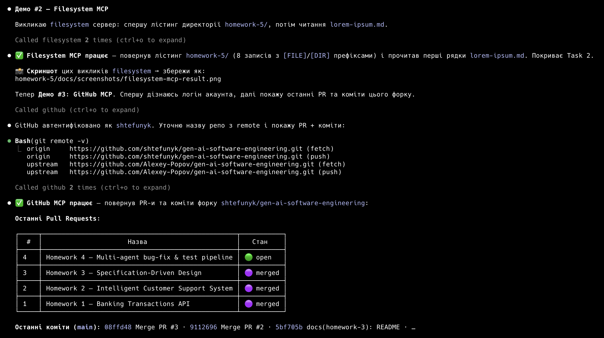
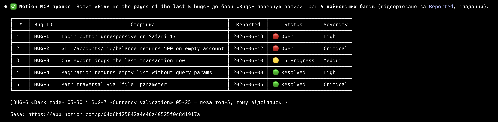
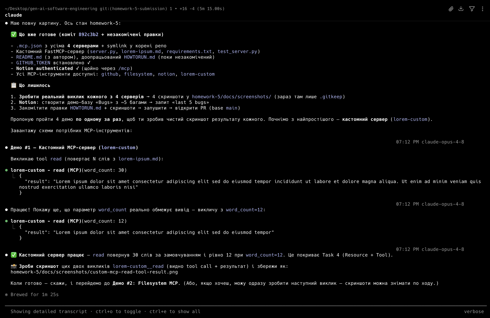

# 🔌 Homework 5 — Configure MCP Servers

> **Student:** Bohdan Shtefunyk (`shtefunyk`)

Three external MCP servers (**GitHub**, **Filesystem**, **Notion**) plus one
**custom FastMCP server** are configured for **Claude Code**. Every server is
registered in a single [`.mcp.json`](.mcp.json), and each is demonstrated with a
real call captured in [`docs/screenshots/`](docs/screenshots).

## Configured servers

| # | Server | Transport | Auth | Demonstrated call |
|---|--------|-----------|------|-------------------|
| 1 | **github** | HTTP `api.githubcopilot.com/mcp/` | `Bearer ${GITHUB_TOKEN}` (env) | list recent PRs / commits of this fork |
| 2 | **filesystem** | stdio `@modelcontextprotocol/server-filesystem` | none | list / read files in the repo |
| 3 | **notion** | HTTP `mcp.notion.com/mcp` | browser OAuth | "last 5 bugs" from a demo **Bugs** database |
| 4 | **lorem-custom** | stdio (Python + FastMCP) | none | `read` tool → N words from `lorem-ipsum.md` |

All four live in one config file:

```jsonc
// .mcp.json
{
  "mcpServers": {
    "github":       { "type": "http", "url": "https://api.githubcopilot.com/mcp/",
                      "headers": { "Authorization": "Bearer ${GITHUB_TOKEN}" } },
    "filesystem":   { "command": "npx", "args": ["-y",
                      "@modelcontextprotocol/server-filesystem", "<repo>"] },
    "notion":       { "type": "http", "url": "https://mcp.notion.com/mcp" },
    "lorem-custom": { "command": "<venv>/bin/python",
                      "args": ["custom-mcp-server/server.py"] }
  }
}
```

> Claude Code reads `.mcp.json` from the **project root**. The canonical file is
> `homework-5/.mcp.json`; a symlink at the repo root points to it so the servers
> load for the whole repository (single source of truth — approach **A**).

## Custom MCP server (Task 4)

[`custom-mcp-server/server.py`](custom-mcp-server/server.py) is built with
**FastMCP** and serves the contents of
[`lorem-ipsum.md`](custom-mcp-server/lorem-ipsum.md), word-limited:

- **Resource** `lorem://words` → first **30** words (the default).
- **Resource** `lorem://words/{word_count}` → first `word_count` words.
- **Tool** `read(word_count: int = 30)` → the same word-limited text, callable by Claude.

The count is clamped to `[0, words_in_file]`, so it always returns exactly the
requested number of words (or all of them, whichever is smaller).

### Resources vs Tools

- **Resources** are *URIs that Claude can read from* — like files or API
  endpoints. Here, `lorem://words` exposes the document's text as readable data.
- **Tools** are *actions Claude can call to perform an operation* — like reading
  a file or running a command. Here, `read` actively returns word-limited content.

A quick local check (no Claude Code needed) exercises both surfaces:

```bash
custom-mcp-server/.venv/bin/python custom-mcp-server/test_server.py
# tool read(7)  -> 'Lorem ipsum dolor sit amet consectetur adipiscing'
# resource lorem://words OK (30 words)
# ALL OK ✅
```

## 🔐 Secrets are never committed

- Config files contain **no tokens** — only `${GITHUB_TOKEN}` expansion.
- The GitHub token comes from the logged-in `gh` CLI at launch time; Notion uses
  browser OAuth (no token at all).
- A repo-level [`.githooks/pre-commit`](../.githooks/pre-commit) guard **blocks any
  commit** whose staged diff matches a token pattern (`ghp_…`, `github_pat_…`,
  `ntn_…`, `secret_…`, AWS, Slack).

## 📸 Screenshots

| GitHub MCP | Filesystem MCP |
|---|---|
|  |  |

| Notion MCP (last 5 bugs) | Custom `read` tool |
|---|---|
|  |  |

## 🤖 AI tools used

- **Claude Code** (Opus 4.8) — design, custom server implementation, configuration,
  documentation, and the secret-guard hook.

## ▶️ Running

See [HOWTORUN.md](HOWTORUN.md) for install → run → connect → test, step by step.
